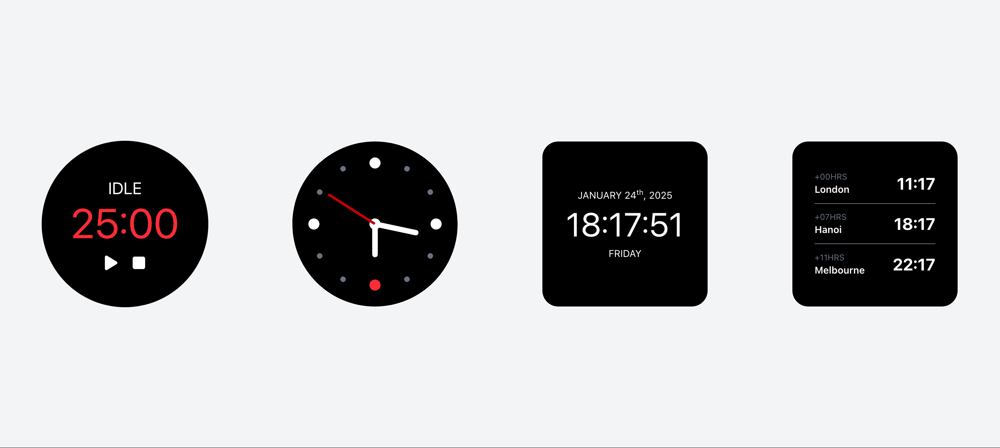
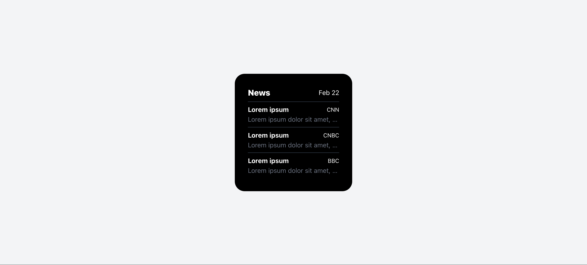
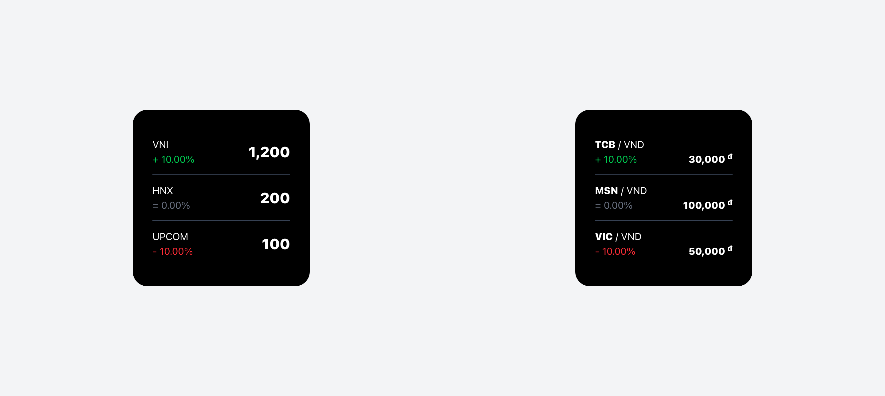
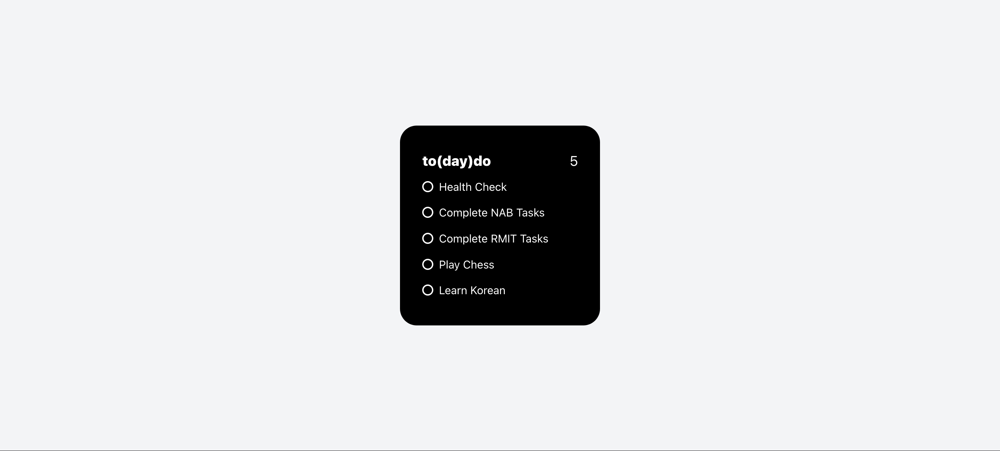
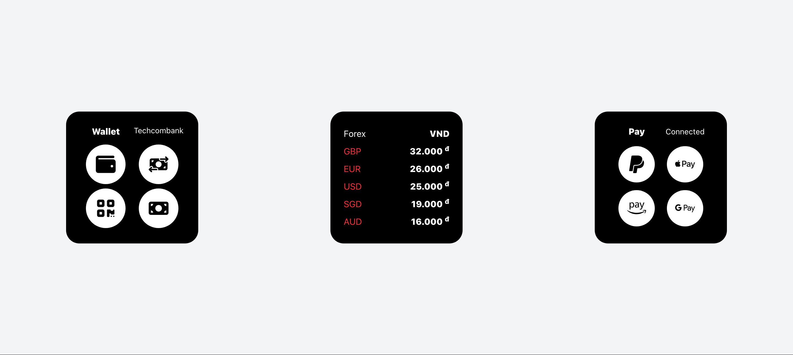
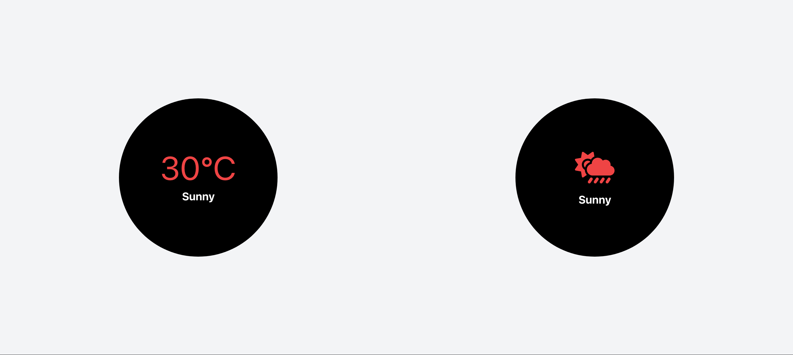
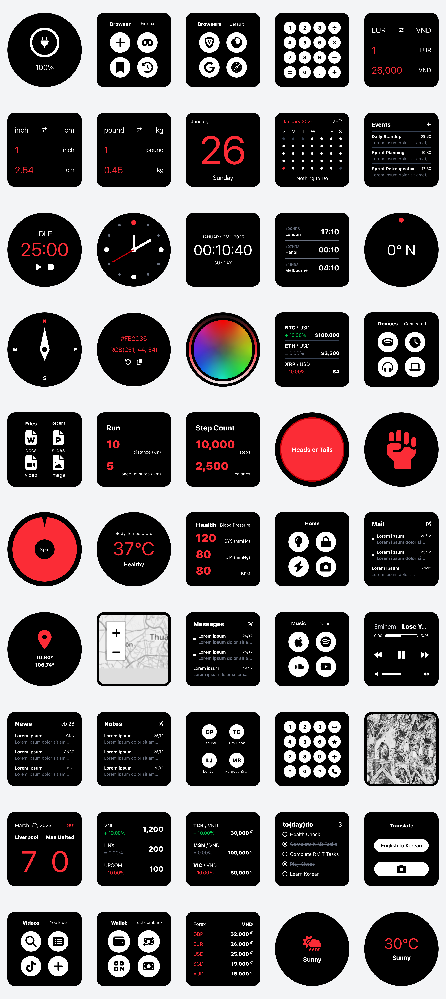

# Nothing

## Table of Content

- [Nothing](#nothing)
  - [Table of Content](#table-of-content)
  - [Home Screen](#home-screen)
    - [Desktop](#desktop)
    - [Mobile](#mobile)
  - [Apps](#apps)
    - [Browser](#browser)
    - [Calculator](#calculator)
    - [Calendar](#calendar)
    - [Clock](#clock)
    - [Compass](#compass)
    - [Files](#files)
    - [Fitness](#fitness)
    - [Health](#health)
    - [Home](#home)
    - [Mail](#mail)
    - [Maps](#maps)
    - [Messages](#messages)
    - [Music](#music)
    - [News](#news)
    - [Notes](#notes)
    - [Phone](#phone)
    - [Photos](#photos)
    - [Settings](#settings)
    - [Stocks](#stocks)
    - [Tasks](#tasks)
    - [Translate](#translate)
    - [Videos](#videos)
    - [Wallet](#wallet)
    - [Weather](#weather)
  - [Widgets](#widgets)

## [Home Screen](https://hieudoanm.github.io/nothing/)

### Desktop

### Mobile

## Apps

### [Browser](https://hieudoanm.github.io/nothing/browser/)

### [Calculator](https://hieudoanm.github.io/nothing/calculator/)

### [Calendar](https://hieudoanm.github.io/nothing/clock/)

### [Clock](https://hieudoanm.github.io/nothing/clock/)

### [Compass](https://hieudoanm.github.io/nothing/compass/)

### [Files](https://hieudoanm.github.io/nothing/files/)

### [Fitness](https://hieudoanm.github.io/nothing/fitness/)

### [Health](https://hieudoanm.github.io/nothing/health/)

### [Home](https://hieudoanm.github.io/nothing/home/)

### [Mail](https://hieudoanm.github.io/nothing/mail/)

### [Maps](https://hieudoanm.github.io/nothing/maps/)

### [Messages](https://hieudoanm.github.io/nothing/messages/)

### [Music](https://hieudoanm.github.io/nothing/music/)

### [News](https://hieudoanm.github.io/nothing/news/)

### [Notes](https://hieudoanm.github.io/nothing/notes/)

### [Phone](https://hieudoanm.github.io/nothing/phone/)

### [Photos](https://hieudoanm.github.io/nothing/photos/)

### [Settings](https://hieudoanm.github.io/nothing/settings/)

### [Stocks](https://hieudoanm.github.io/nothing/stocks/)

### [Tasks](https://hieudoanm.github.io/nothing/tasks/)

### [Translate](https://hieudoanm.github.io/nothing/translate/)

### [Videos](https://hieudoanm.github.io/nothing/videos/)

### [Wallet](https://hieudoanm.github.io/nothing/wallet/)

### [Weather](https://hieudoanm.github.io/nothing/weather/)

## [Widgets](https://hieudoanm.github.io/nothing/)

