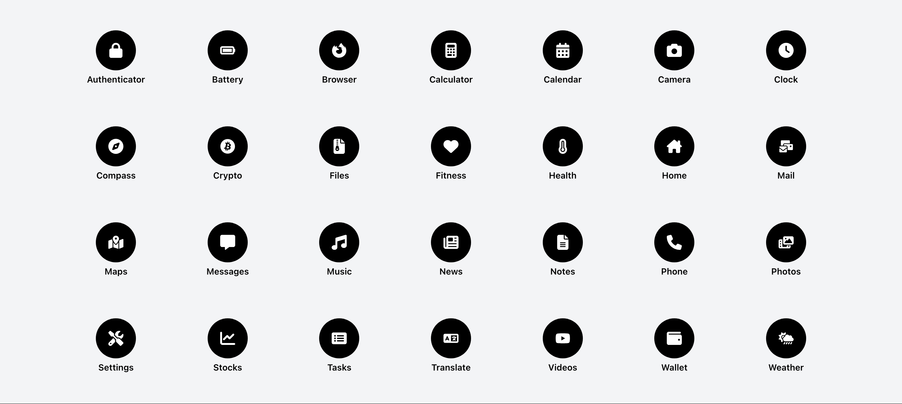
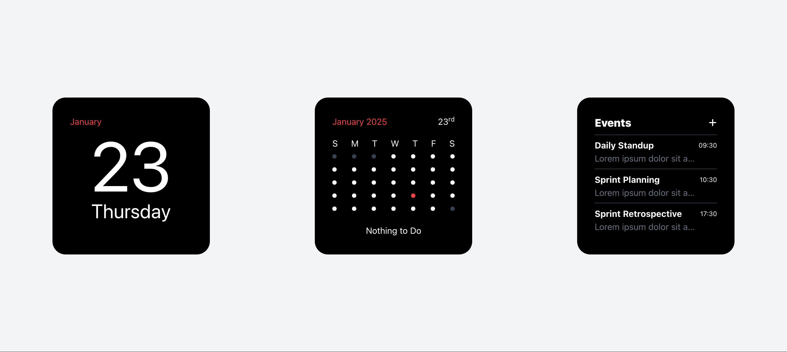
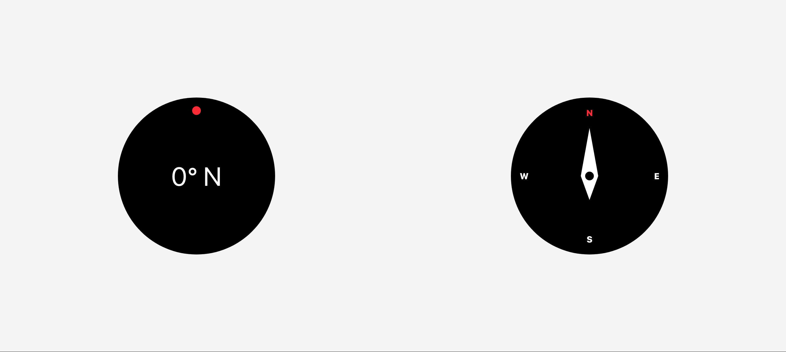
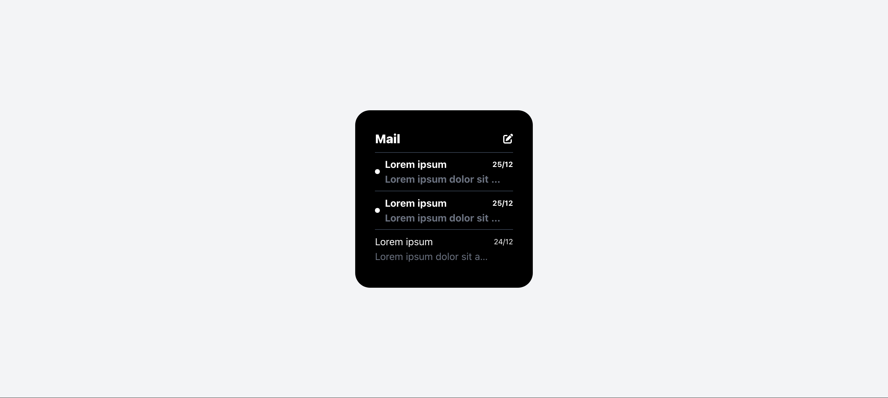
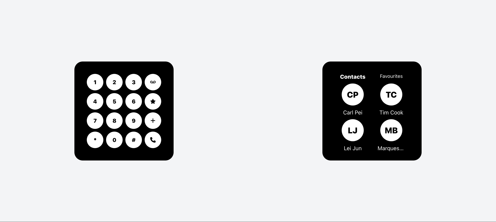
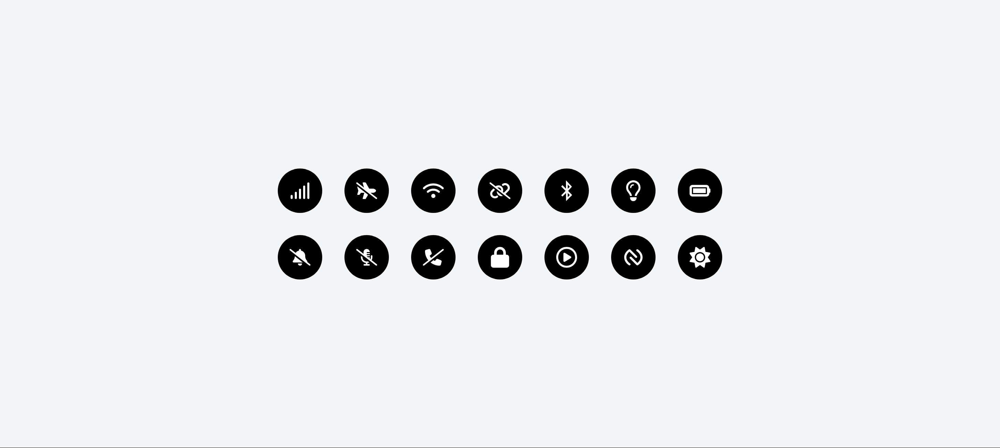

# Nothing

## Table of Content

- [Nothing](#nothing)
  - [Table of Content](#table-of-content)
  - [Home Screen](#home-screen)
    - [Desktop](#desktop)
    - [Mobile](#mobile)
  - [Apps](#apps)
    - [Browser](#browser)
    - [Calculator](#calculator)
    - [Calendar](#calendar)
    - [Clock](#clock)
    - [Compass](#compass)
    - [Files](#files)
    - [Fitness](#fitness)
    - [Health](#health)
    - [Home](#home)
    - [Mail](#mail)
    - [Maps](#maps)
    - [Messages](#messages)
    - [Music](#music)
    - [News](#news)
    - [Notes](#notes)
    - [Phone](#phone)
    - [Photos](#photos)
    - [Settings](#settings)
    - [Stocks](#stocks)
    - [Tasks](#tasks)
    - [Translate](#translate)
    - [Videos](#videos)
    - [Wallet](#wallet)
    - [Weather](#weather)

## Home Screen

### Desktop

### Mobile

## Apps

### Browser

### Calculator

### Calendar

### Clock

### Compass

### Files

### Fitness

### Health

### Home

### Mail

### Maps

### Messages

### Music

### News

### Notes

### Phone

### Photos

### Settings

### Stocks

### Tasks

### Translate

### Videos

### Wallet

### Weather

