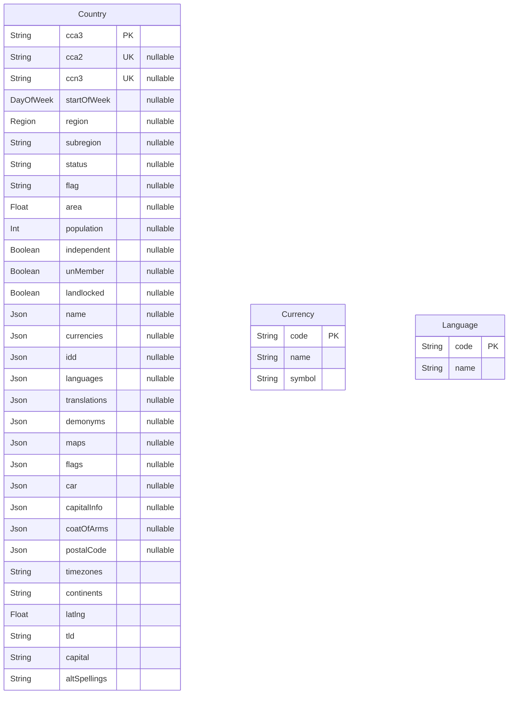

# Prisma Markdown

> Generated by [`prisma-markdown`](https://github.com/samchon/prisma-markdown)

- [default](#default)

## default

### `Country`

**Properties**

- `cca3`:
- `cca2`:
- `ccn3`:
- `startOfWeek`:
- `region`:
- `subregion`:
- `status`:
- `flag`:
- `area`:
- `population`:
- `independent`:
- `unMember`:
- `landlocked`:
- `name`:
- `currencies`:
- `idd`:
- `languages`:
- `translations`:
- `demonyms`:
- `maps`:
- `flags`:
- `car`:
- `capitalInfo`:
- `coatOfArms`:
- `postalCode`:
- `timezones`:
- `continents`:
- `latlng`:
- `tld`:
- `capital`:
- `altSpellings`:

### `Currency`

**Properties**

- `code`:
- `name`:
- `symbol`:

### `Language`

**Properties**

- `code`:
- `name`:
