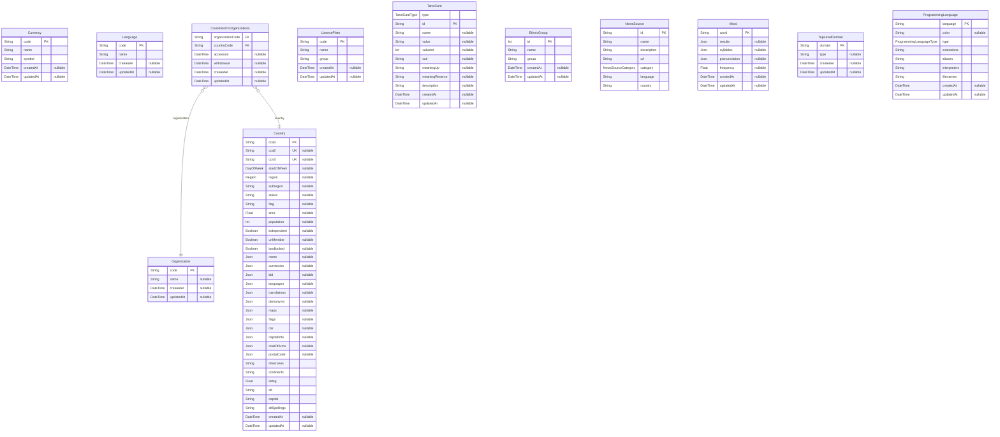

# Prisma Markdown

> Generated by [`prisma-markdown`](https://github.com/samchon/prisma-markdown)

- [default](#default)

## default

### `Country`

**Properties**

- `cca3`:
- `cca2`:
- `ccn3`:
- `startOfWeek`:
- `region`:
- `subregion`:
- `status`:
- `flag`:
- `area`:
- `population`:
- `independent`:
- `unMember`:
- `landlocked`:
- `name`:
- `currencies`:
- `idd`:
- `languages`:
- `translations`:
- `demonyms`:
- `maps`:
- `flags`:
- `car`:
- `capitalInfo`:
- `coatOfArms`:
- `postalCode`:
- `timezones`:
- `continents`:
- `latlng`:
- `tld`:
- `capital`:
- `altSpellings`:
- `createdAt`:
- `updatedAt`:

### `Currency`

**Properties**

- `code`:
- `name`:
- `symbol`:
- `createdAt`:
- `updatedAt`:

### `Language`

**Properties**

- `code`:
- `name`:
- `createdAt`:
- `updatedAt`:

### `Organization`

**Properties**

- `code`:
- `name`:
- `createdAt`:
- `updatedAt`:

### `CountriesOnOrganizations`

**Properties**

- `organizationCode`:
- `countryCode`:
- `accession`:
- `withdrawal`:
- `createdAt`:
- `updatedAt`:

### `LicensePlate`

**Properties**

- `code`:
- `name`:
- `group`:
- `createdAt`:
- `updatedAt`:

### `TarotCard`

**Properties**

- `type`:
- `id`:
- `name`:
- `value`:
- `valueInt`:
- `suit`:
- `meaningUp`:
- `meaningReverse`:
- `description`:
- `createdAt`:
- `updatedAt`:

### `EthnicGroup`

**Properties**

- `id`:
- `name`:
- `group`:
- `createdAt`:
- `updatedAt`:

### `NewsSource`

**Properties**

- `id`:
- `name`:
- `description`:
- `url`:
- `category`:
- `language`:
- `country`:

### `Word`

**Properties**

- `word`:
- `results`:
- `syllables`:
- `pronunciation`:
- `frequency`:
- `createdAt`:
- `updatedAt`:

### `TopLevelDomain`

**Properties**

- `domain`:
- `type`:
- `createdAt`:
- `updatedAt`:

### `ProgrammingLanguage`

**Properties**

- `language`:
- `color`:
- `type`:
- `extensions`:
- `aliases`:
- `interpreters`:
- `filenames`:
- `createdAt`:
- `updatedAt`:
