# Prisma Markdown
> Generated by [`prisma-markdown`](https://github.com/samchon/prisma-markdown)

- [default](#default)

## default

```mermaid
erDiagram
"Country" {
    String name "nullable"
    String cca3 PK
    String cca2 UK "nullable"
    String ccn3 UK "nullable"
    DayOfWeek startOfWeek "nullable"
    Region region "nullable"
    String subregion "nullable"
    String status "nullable"
    String flag "nullable"
    Float area "nullable"
    Int population "nullable"
    Boolean independent "nullable"
    Boolean unMember "nullable"
    Boolean landlocked "nullable"
    Json idd "nullable"
    Json demonyms "nullable"
    Json maps "nullable"
    Json flags "nullable"
    Json car "nullable"
    Json capitalInfo "nullable"
    Json coatOfArms "nullable"
    Json postalCode "nullable"
    String timezones
    String continents
    Float latlng
    String tld
    String capital
    String altSpellings
    DateTime createdAt "nullable"
    DateTime updatedAt "nullable"
}
"CountryName" {
    String countryCode FK
    String languageCode FK
    String common "nullable"
    String official "nullable"
    Boolean native "nullable"
    DateTime createdAt "nullable"
    DateTime updatedAt "nullable"
}
"City" {
    Int id PK
    Boolean capital
    String city
    String state
    String countryCode FK
    Float latitude
    Float longitude
    DateTime createdAt "nullable"
    DateTime updatedAt "nullable"
}
"Currency" {
    String code PK
    String name
    String symbol
    DateTime createdAt "nullable"
    DateTime updatedAt "nullable"
}
"CurrencyHistory" {
    String currencyCode FK
    DateTime date
    Float rate
    Int amount
    String base
    DateTime createdAt "nullable"
    DateTime updatedAt "nullable"
}
"CurrenciesInCountries" {
    String currencyCode FK
    String countryCode FK
    DateTime createdAt "nullable"
    DateTime updatedAt "nullable"
}
"Language" {
    String code PK
    String name
    Int category
    DateTime createdAt "nullable"
    DateTime updatedAt "nullable"
}
"LanguagesInCountries" {
    String languageCode FK
    String countryCode FK
    DateTime createdAt "nullable"
    DateTime updatedAt "nullable"
}
"Organization" {
    String code PK
    String name "nullable"
    DateTime createdAt "nullable"
    DateTime updatedAt "nullable"
}
"CountriesOnOrganizations" {
    String organizationCode FK
    String countryCode FK
    DateTime accession "nullable"
    DateTime withdrawal "nullable"
    DateTime createdAt "nullable"
    DateTime updatedAt "nullable"
}
"LicensePlate" {
    String code PK
    String name
    String group
    DateTime createdAt "nullable"
    DateTime updatedAt "nullable"
}
"EthnicGroup" {
    Int id PK
    String name
    String group
    DateTime createdAt "nullable"
    DateTime updatedAt "nullable"
}
"TarotCard" {
    TarotCardType type
    String id PK
    String name "nullable"
    String value "nullable"
    Int valueInt "nullable"
    String suit "nullable"
    String meaningUp "nullable"
    String meaningReverse "nullable"
    String description "nullable"
    DateTime createdAt "nullable"
    DateTime updatedAt "nullable"
}
"NewsSource" {
    String id PK
    String name
    String description
    String url
    NewsSourceCategory category
    String language
    String country
}
"Word" {
    String word PK
    Json results "nullable"
    Json syllables "nullable"
    Json pronunciation "nullable"
    Float frequency "nullable"
    DateTime createdAt "nullable"
    DateTime updatedAt "nullable"
}
"TopLevelDomain" {
    String domain PK
    String type "nullable"
    DateTime createdAt "nullable"
    DateTime updatedAt "nullable"
}
"ProgrammingLanguage" {
    String language PK
    String color "nullable"
    ProgrammingLanguageType type
    String extensions
    String aliases
    String interpreters
    String filenames
    DateTime createdAt "nullable"
    DateTime updatedAt "nullable"
}
"License" {
    String id PK
    String name "nullable"
    String spdx "nullable"
    String node "nullable"
    String html "nullable"
    String description "nullable"
    String implementation "nullable"
    String body "nullable"
    String permissions
    String conditions
    String limitations
    DateTime createdAt "nullable"
    DateTime updatedAt "nullable"
}
"UnitedStatesCongress" {
    Int congress PK
    String houseControl "nullable"
    String senateControl "nullable"
    String congressControl "nullable"
    String trifectaControl "nullable"
    DateTime startDate "nullable"
    DateTime endDate "nullable"
    DateTime createdAt "nullable"
    DateTime updatedAt "nullable"
}
"UnitedStatesCongressMember" {
    String id PK
    String firstName "nullable"
    String middleName "nullable"
    String lastName "nullable"
    String suffix "nullable"
    DateTime dateOfBirth "nullable"
    String gender "nullable"
    DateTime createdAt "nullable"
    DateTime updatedAt "nullable"
    Int unitedStatesCongressCongress FK "nullable"
}
"UnitedStatesCongressMembersInCongresses" {
    UnitedStatesCongressChamber chamber
    Int congressNumber FK
    String memberId FK
    String title "nullable"
    String shortTitle "nullable"
    String party "nullable"
    String leadershipRole "nullable"
    Int seniority "nullable"
    String state "nullable"
    String district "nullable"
    Boolean atLarge "nullable"
    DateTime createdAt "nullable"
    DateTime updatedAt "nullable"
}
"UnitedStatesCongressCommittee" {
    UnitedStatesCongressChamber chamber
    Int congressNumber FK
    String id
    String name "nullable"
    String chairId FK "nullable"
    DateTime createdAt "nullable"
    DateTime updatedAt "nullable"
}
"ChessPlayer" {
    Int id PK
    String username UK
    String name
    Int followers
    String avatar
    String location
    String country
    String countryCode
    String twitchUrl
    Boolean isStreamer
    Boolean verified
    DateTime lastOnline
    DateTime joined
    Status status
    ChessTitle title "nullable"
    League league "nullable"
    Int statsDailyRatingBest
    Int statsDailyRatingLast
    Int statsDailyRatingDeviation
    Int statsDailyRecordWin
    Int statsDailyRecordDraw
    Int statsDailyRecordLoss
    Int statsRapidRatingBest
    Int statsRapidRatingLast
    Int statsRapidRatingDeviation
    Int statsRapidRecordWin
    Int statsRapidRecordDraw
    Int statsRapidRecordLoss
    Int statsBlitzRatingLast
    Int statsBlitzRatingBest
    Int statsBlitzRatingDeviation
    Int statsBlitzRecordWin
    Int statsBlitzRecordDraw
    Int statsBlitzRecordLoss
    Int statsBulletRatingLast
    Int statsBulletRatingBest
    Int statsBulletRatingDeviation
    Int statsBulletRecordWin
    Int statsBulletRecordDraw
    Int statsBulletRecordLoss
    String archives
    DateTime createdAt "nullable"
    DateTime updatedAt "nullable"
}
"ChessGame" {
    String id PK
    String url
    String pgn
    String timeControl
    ChessTimeClass timeClass
    DateTime endTime
    Boolean rated
    String tcn
    String initialSetup
    ChessVariant rules
    String whiteId
    String blackId
    String whiteUsername
    String blackUsername
    Float whiteAccuracy
    Float blackAccuracy
    ChessResult whiteResult
    ChessResult blackResult
    Int whiteRating
    Int blackRating
    String fen
    DateTime createdAt "nullable"
    DateTime updatedAt "nullable"
}
"ChessOpening" {
    String eco
    String name
    String pgn
    DateTime createdAt "nullable"
    DateTime updatedAt "nullable"
}
"Quote" {
    String id PK
    String author "nullable"
    String authorSlug "nullable"
    String content "nullable"
    String tags
    DateTime createdAt "nullable"
    DateTime updatedAt "nullable"
}
"University" {
    Int rank PK
    String university "nullable"
    String city "nullable"
    String countryCode FK "nullable"
    DateTime createdAt "nullable"
    DateTime updatedAt "nullable"
}
"CountryName" }o--|| "Country" : country
"CountryName" }o--|| "Language" : language
"City" }o--|| "Country" : country
"CurrencyHistory" }o--|| "Currency" : currency
"CurrenciesInCountries" }o--|| "Currency" : currency
"CurrenciesInCountries" }o--|| "Country" : country
"LanguagesInCountries" }o--|| "Language" : language
"LanguagesInCountries" }o--|| "Country" : country
"CountriesOnOrganizations" }o--|| "Organization" : organization
"CountriesOnOrganizations" }o--|| "Country" : country
"UnitedStatesCongressMember" }o--|| "UnitedStatesCongress" : UnitedStatesCongress
"UnitedStatesCongressMembersInCongresses" }o--|| "UnitedStatesCongress" : congress
"UnitedStatesCongressMembersInCongresses" }o--|| "UnitedStatesCongressMember" : member
"UnitedStatesCongressCommittee" }o--|| "UnitedStatesCongress" : congress
"UnitedStatesCongressCommittee" }o--|| "UnitedStatesCongressMember" : chair
"University" }o--|| "Country" : country
```

### `Country`

**Properties**
  - `name`: 
  - `cca3`: 
  - `cca2`: 
  - `ccn3`: 
  - `startOfWeek`: 
  - `region`: 
  - `subregion`: 
  - `status`: 
  - `flag`: 
  - `area`: 
  - `population`: 
  - `independent`: 
  - `unMember`: 
  - `landlocked`: 
  - `idd`: 
  - `demonyms`: 
  - `maps`: 
  - `flags`: 
  - `car`: 
  - `capitalInfo`: 
  - `coatOfArms`: 
  - `postalCode`: 
  - `timezones`: 
  - `continents`: 
  - `latlng`: 
  - `tld`: 
  - `capital`: 
  - `altSpellings`: 
  - `createdAt`: 
  - `updatedAt`: 

### `CountryName`

**Properties**
  - `countryCode`: 
  - `languageCode`: 
  - `common`: 
  - `official`: 
  - `native`: 
  - `createdAt`: 
  - `updatedAt`: 

### `City`

**Properties**
  - `id`: 
  - `capital`: 
  - `city`: 
  - `state`: 
  - `countryCode`: 
  - `latitude`: 
  - `longitude`: 
  - `createdAt`: 
  - `updatedAt`: 

### `Currency`

**Properties**
  - `code`: 
  - `name`: 
  - `symbol`: 
  - `createdAt`: 
  - `updatedAt`: 

### `CurrencyHistory`

**Properties**
  - `currencyCode`: 
  - `date`: 
  - `rate`: 
  - `amount`: 
  - `base`: 
  - `createdAt`: 
  - `updatedAt`: 

### `CurrenciesInCountries`

**Properties**
  - `currencyCode`: 
  - `countryCode`: 
  - `createdAt`: 
  - `updatedAt`: 

### `Language`

**Properties**
  - `code`: 
  - `name`: 
  - `category`: 
  - `createdAt`: 
  - `updatedAt`: 

### `LanguagesInCountries`

**Properties**
  - `languageCode`: 
  - `countryCode`: 
  - `createdAt`: 
  - `updatedAt`: 

### `Organization`

**Properties**
  - `code`: 
  - `name`: 
  - `createdAt`: 
  - `updatedAt`: 

### `CountriesOnOrganizations`

**Properties**
  - `organizationCode`: 
  - `countryCode`: 
  - `accession`: 
  - `withdrawal`: 
  - `createdAt`: 
  - `updatedAt`: 

### `LicensePlate`

**Properties**
  - `code`: 
  - `name`: 
  - `group`: 
  - `createdAt`: 
  - `updatedAt`: 

### `EthnicGroup`

**Properties**
  - `id`: 
  - `name`: 
  - `group`: 
  - `createdAt`: 
  - `updatedAt`: 

### `TarotCard`

**Properties**
  - `type`: 
  - `id`: 
  - `name`: 
  - `value`: 
  - `valueInt`: 
  - `suit`: 
  - `meaningUp`: 
  - `meaningReverse`: 
  - `description`: 
  - `createdAt`: 
  - `updatedAt`: 

### `NewsSource`

**Properties**
  - `id`: 
  - `name`: 
  - `description`: 
  - `url`: 
  - `category`: 
  - `language`: 
  - `country`: 

### `Word`

**Properties**
  - `word`: 
  - `results`: 
  - `syllables`: 
  - `pronunciation`: 
  - `frequency`: 
  - `createdAt`: 
  - `updatedAt`: 

### `TopLevelDomain`

**Properties**
  - `domain`: 
  - `type`: 
  - `createdAt`: 
  - `updatedAt`: 

### `ProgrammingLanguage`

**Properties**
  - `language`: 
  - `color`: 
  - `type`: 
  - `extensions`: 
  - `aliases`: 
  - `interpreters`: 
  - `filenames`: 
  - `createdAt`: 
  - `updatedAt`: 

### `License`

**Properties**
  - `id`: 
  - `name`: 
  - `spdx`: 
  - `node`: 
  - `html`: 
  - `description`: 
  - `implementation`: 
  - `body`: 
  - `permissions`: 
  - `conditions`: 
  - `limitations`: 
  - `createdAt`: 
  - `updatedAt`: 

### `UnitedStatesCongress`

**Properties**
  - `congress`: 
  - `houseControl`: 
  - `senateControl`: 
  - `congressControl`: 
  - `trifectaControl`: 
  - `startDate`: 
  - `endDate`: 
  - `createdAt`: 
  - `updatedAt`: 

### `UnitedStatesCongressMember`

**Properties**
  - `id`: 
  - `firstName`: 
  - `middleName`: 
  - `lastName`: 
  - `suffix`: 
  - `dateOfBirth`: 
  - `gender`: 
  - `createdAt`: 
  - `updatedAt`: 
  - `unitedStatesCongressCongress`: 

### `UnitedStatesCongressMembersInCongresses`

**Properties**
  - `chamber`: 
  - `congressNumber`: 
  - `memberId`: 
  - `title`: 
  - `shortTitle`: 
  - `party`: 
  - `leadershipRole`: 
  - `seniority`: 
  - `state`: 
  - `district`: 
  - `atLarge`: 
  - `createdAt`: 
  - `updatedAt`: 

### `UnitedStatesCongressCommittee`

**Properties**
  - `chamber`: 
  - `congressNumber`: 
  - `id`: 
  - `name`: 
  - `chairId`: 
  - `createdAt`: 
  - `updatedAt`: 

### `ChessPlayer`

**Properties**
  - `id`: 
  - `username`: 
  - `name`: 
  - `followers`: 
  - `avatar`: 
  - `location`: 
  - `country`: 
  - `countryCode`: 
  - `twitchUrl`: 
  - `isStreamer`: 
  - `verified`: 
  - `lastOnline`: 
  - `joined`: 
  - `status`: 
  - `title`: 
  - `league`: 
  - `statsDailyRatingBest`: 
  - `statsDailyRatingLast`: 
  - `statsDailyRatingDeviation`: 
  - `statsDailyRecordWin`: 
  - `statsDailyRecordDraw`: 
  - `statsDailyRecordLoss`: 
  - `statsRapidRatingBest`: 
  - `statsRapidRatingLast`: 
  - `statsRapidRatingDeviation`: 
  - `statsRapidRecordWin`: 
  - `statsRapidRecordDraw`: 
  - `statsRapidRecordLoss`: 
  - `statsBlitzRatingLast`: 
  - `statsBlitzRatingBest`: 
  - `statsBlitzRatingDeviation`: 
  - `statsBlitzRecordWin`: 
  - `statsBlitzRecordDraw`: 
  - `statsBlitzRecordLoss`: 
  - `statsBulletRatingLast`: 
  - `statsBulletRatingBest`: 
  - `statsBulletRatingDeviation`: 
  - `statsBulletRecordWin`: 
  - `statsBulletRecordDraw`: 
  - `statsBulletRecordLoss`: 
  - `archives`: 
  - `createdAt`: 
  - `updatedAt`: 

### `ChessGame`

**Properties**
  - `id`: 
  - `url`: 
  - `pgn`: 
  - `timeControl`: 
  - `timeClass`: 
  - `endTime`: 
  - `rated`: 
  - `tcn`: 
  - `initialSetup`: 
  - `rules`: 
  - `whiteId`: 
  - `blackId`: 
  - `whiteUsername`: 
  - `blackUsername`: 
  - `whiteAccuracy`: 
  - `blackAccuracy`: 
  - `whiteResult`: 
  - `blackResult`: 
  - `whiteRating`: 
  - `blackRating`: 
  - `fen`: 
  - `createdAt`: 
  - `updatedAt`: 

### `ChessOpening`

**Properties**
  - `eco`: 
  - `name`: 
  - `pgn`: 
  - `createdAt`: 
  - `updatedAt`: 

### `Quote`

**Properties**
  - `id`: 
  - `author`: 
  - `authorSlug`: 
  - `content`: 
  - `tags`: 
  - `createdAt`: 
  - `updatedAt`: 

### `University`

**Properties**
  - `rank`: 
  - `university`: 
  - `city`: 
  - `countryCode`: 
  - `createdAt`: 
  - `updatedAt`: 