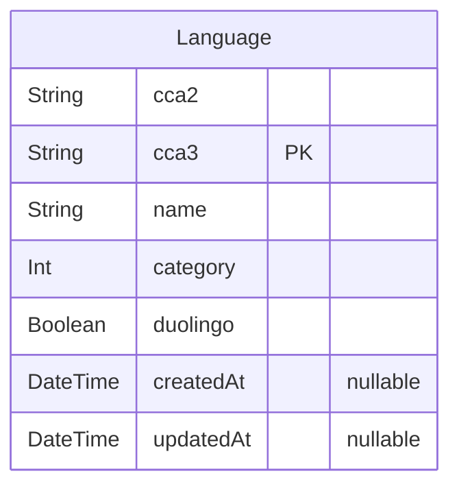

# Prisma Markdown

> Generated by [`prisma-markdown`](https://github.com/samchon/prisma-markdown)

- [Prisma Markdown](#prisma-markdown)
  - [default](#default)
    - [`Language`](#language)

## default

### `Language`

**Properties**

- `cca2`:
- `cca3`:
- `name`:
- `category`:
- `duolingo`:
- `createdAt`:
- `updatedAt`:
