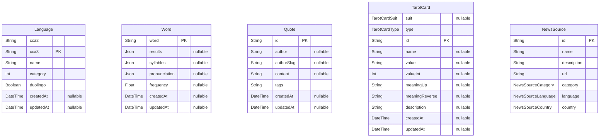

# Prisma Markdown
> Generated by [`prisma-markdown`](https://github.com/samchon/prisma-markdown)

- [default](#default)

## default

### `Language`

**Properties**
  - `cca2`: 
  - `cca3`: 
  - `name`: 
  - `category`: 
  - `duolingo`: 
  - `createdAt`: 
  - `updatedAt`: 

### `Word`

**Properties**
  - `word`: 
  - `results`: 
  - `syllables`: 
  - `pronunciation`: 
  - `frequency`: 
  - `createdAt`: 
  - `updatedAt`: 

### `Quote`

**Properties**
  - `id`: 
  - `author`: 
  - `authorSlug`: 
  - `content`: 
  - `tags`: 
  - `createdAt`: 
  - `updatedAt`: 

### `TarotCard`

**Properties**
  - `suit`: 
  - `type`: 
  - `id`: 
  - `name`: 
  - `value`: 
  - `valueInt`: 
  - `meaningUp`: 
  - `meaningReverse`: 
  - `description`: 
  - `createdAt`: 
  - `updatedAt`: 

### `NewsSource`

**Properties**
  - `id`: 
  - `name`: 
  - `description`: 
  - `url`: 
  - `category`: 
  - `language`: 
  - `country`: 