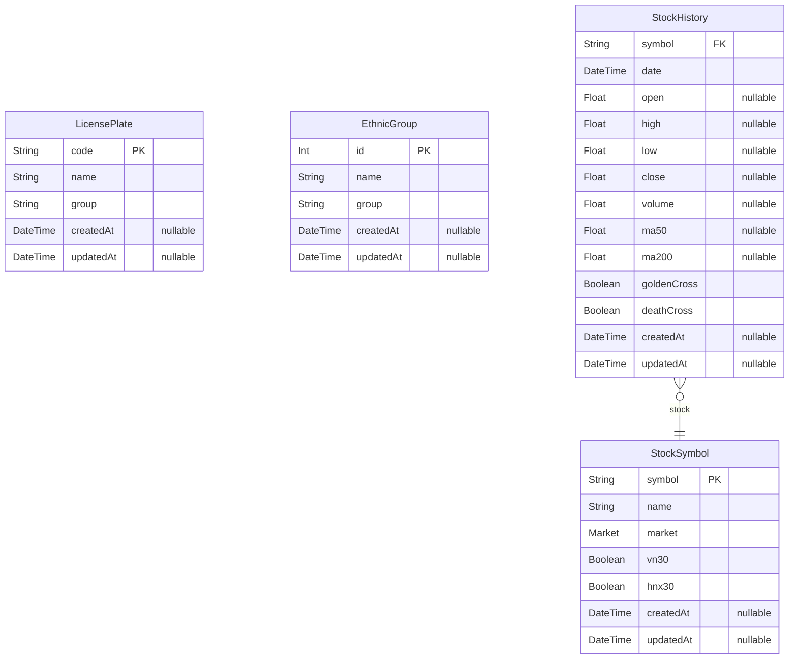

# Prisma Markdown

> Generated by [`prisma-markdown`](https://github.com/samchon/prisma-markdown)

- [default](#default)

## default

### `LicensePlate`

**Properties**

- `code`:
- `name`:
- `group`:
- `createdAt`:
- `updatedAt`:

### `EthnicGroup`

**Properties**

- `id`:
- `name`:
- `group`:
- `createdAt`:
- `updatedAt`:

### `StockSymbol`

**Properties**

- `symbol`:
- `name`:
- `market`:
- `vn30`:
- `hnx30`:
- `createdAt`:
- `updatedAt`:

### `StockHistory`

**Properties**

- `symbol`:
- `date`:
- `open`:
- `high`:
- `low`:
- `close`:
- `volume`:
- `ma50`:
- `ma200`:
- `goldenCross`:
- `deathCross`:
- `createdAt`:
- `updatedAt`:
