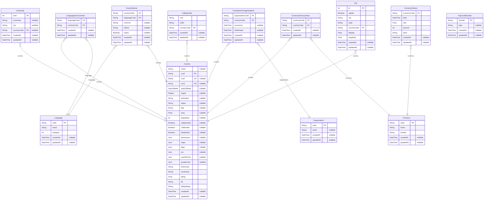

# Prisma Markdown
> Generated by [`prisma-markdown`](https://github.com/samchon/prisma-markdown)

- [default](#default)

## default

### `Country`

**Properties**
  - `name`: 
  - `cca3`: 
  - `cca2`: 
  - `ccn3`: 
  - `startOfWeek`: 
  - `region`: 
  - `subregion`: 
  - `status`: 
  - `flag`: 
  - `area`: 
  - `population`: 
  - `independent`: 
  - `unMember`: 
  - `landlocked`: 
  - `demonyms`: 
  - `maps`: 
  - `flags`: 
  - `car`: 
  - `coatOfArms`: 
  - `postalCode`: 
  - `timezones`: 
  - `continents`: 
  - `latlng`: 
  - `tld`: 
  - `altSpellings`: 
  - `createdAt`: 
  - `updatedAt`: 

### `CountryName`

**Properties**
  - `countryCode`: 
  - `languageCode`: 
  - `common`: 
  - `official`: 
  - `native`: 
  - `createdAt`: 
  - `updatedAt`: 

### `City`

**Properties**
  - `id`: 
  - `capital`: 
  - `city`: 
  - `state`: 
  - `countryCode`: 
  - `latitude`: 
  - `longitude`: 
  - `createdAt`: 
  - `updatedAt`: 

### `CallingCode`

**Properties**
  - `root`: 
  - `suffix`: 
  - `countryCode`: 
  - `createdAt`: 
  - `updatedAt`: 

### `Currency`

**Properties**
  - `code`: 
  - `name`: 
  - `symbol`: 
  - `createdAt`: 
  - `updatedAt`: 

### `CurrencyHistory`

**Properties**
  - `currencyCode`: 
  - `date`: 
  - `rate`: 
  - `amount`: 
  - `base`: 
  - `createdAt`: 
  - `updatedAt`: 

### `CurrenciesInCountries`

**Properties**
  - `currencyCode`: 
  - `countryCode`: 
  - `createdAt`: 
  - `updatedAt`: 

### `Language`

**Properties**
  - `code`: 
  - `name`: 
  - `category`: 
  - `createdAt`: 
  - `updatedAt`: 

### `LanguagesInCountries`

**Properties**
  - `languageCode`: 
  - `countryCode`: 
  - `createdAt`: 
  - `updatedAt`: 

### `Organization`

**Properties**
  - `code`: 
  - `name`: 
  - `createdAt`: 
  - `updatedAt`: 

### `CountriesOnOrganizations`

**Properties**
  - `organizationCode`: 
  - `countryCode`: 
  - `accession`: 
  - `withdrawal`: 
  - `createdAt`: 
  - `updatedAt`: 

### `University`

**Properties**
  - `rank`: 
  - `university`: 
  - `city`: 
  - `countryCode`: 
  - `createdAt`: 
  - `updatedAt`: 

### `TopLevelDomain`

**Properties**
  - `domain`: 
  - `type`: 
  - `createdAt`: 
  - `updatedAt`: 