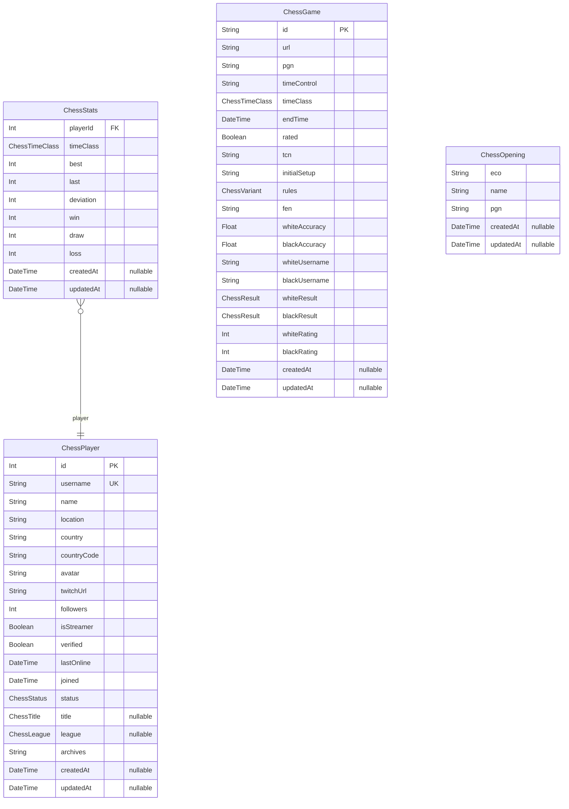

# Prisma Markdown

> Generated by [`prisma-markdown`](https://github.com/samchon/prisma-markdown)

- [default](#default)

## default

### `ChessPlayer`

**Properties**

- `id`:
- `username`:
- `name`:
- `location`:
- `country`:
- `countryCode`:
- `avatar`:
- `twitchUrl`:
- `followers`:
- `isStreamer`:
- `verified`:
- `lastOnline`:
- `joined`:
- `status`:
- `title`:
- `league`:
- `archives`:
- `createdAt`:
- `updatedAt`:

### `ChessStats`

**Properties**

- `playerId`:
- `timeClass`:
- `best`:
- `last`:
- `deviation`:
- `win`:
- `draw`:
- `loss`:
- `createdAt`:
- `updatedAt`:

### `ChessGame`

**Properties**

- `id`:
- `url`:
- `pgn`:
- `timeControl`:
- `timeClass`:
- `endTime`:
- `rated`:
- `tcn`:
- `initialSetup`:
- `rules`:
- `fen`:
- `whiteAccuracy`:
- `blackAccuracy`:
- `whiteUsername`:
- `blackUsername`:
- `whiteResult`:
- `blackResult`:
- `whiteRating`:
- `blackRating`:
- `createdAt`:
- `updatedAt`:

### `ChessOpening`

**Properties**

- `eco`:
- `name`:
- `pgn`:
- `createdAt`:
- `updatedAt`:
