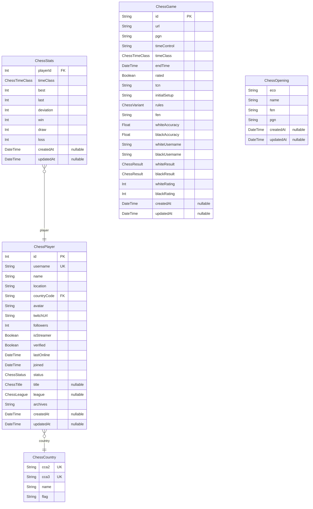

# Prisma Markdown
> Generated by [`prisma-markdown`](https://github.com/samchon/prisma-markdown)

- [default](#default)

## default

### `ChessPlayer`

**Properties**
  - `id`: 
  - `username`: 
  - `name`: 
  - `location`: 
  - `countryCode`: 
  - `avatar`: 
  - `twitchUrl`: 
  - `followers`: 
  - `isStreamer`: 
  - `verified`: 
  - `lastOnline`: 
  - `joined`: 
  - `status`: 
  - `title`: 
  - `league`: 
  - `archives`: 
  - `createdAt`: 
  - `updatedAt`: 

### `ChessCountry`

**Properties**
  - `cca2`: 
  - `cca3`: 
  - `name`: 
  - `flag`: 

### `ChessStats`

**Properties**
  - `playerId`: 
  - `timeClass`: 
  - `best`: 
  - `last`: 
  - `deviation`: 
  - `win`: 
  - `draw`: 
  - `loss`: 
  - `createdAt`: 
  - `updatedAt`: 

### `ChessGame`

**Properties**
  - `id`: 
  - `url`: 
  - `pgn`: 
  - `timeControl`: 
  - `timeClass`: 
  - `endTime`: 
  - `rated`: 
  - `tcn`: 
  - `initialSetup`: 
  - `rules`: 
  - `fen`: 
  - `whiteAccuracy`: 
  - `blackAccuracy`: 
  - `whiteUsername`: 
  - `blackUsername`: 
  - `whiteResult`: 
  - `blackResult`: 
  - `whiteRating`: 
  - `blackRating`: 
  - `createdAt`: 
  - `updatedAt`: 

### `ChessOpening`

**Properties**
  - `eco`: 
  - `name`: 
  - `fen`: 
  - `pgn`: 
  - `createdAt`: 
  - `updatedAt`: 