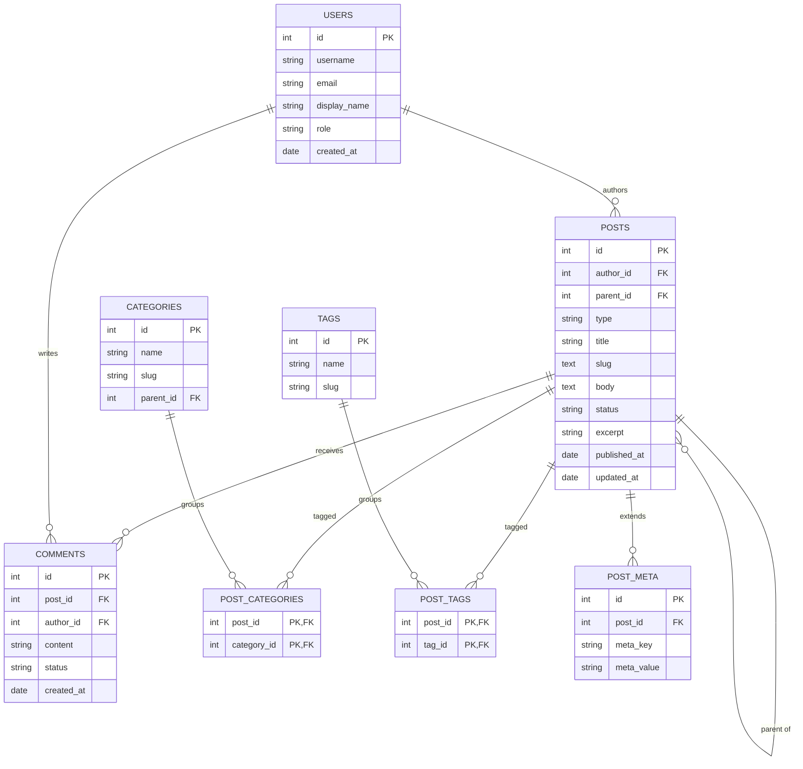

# Blog / CMS Platform

> A WordPress/Medium-style content management system: authors, posts, pages,
> categories, tags, comments, and metadata. The canonical "post + taxonomy +
> comments" schema every CMS reimplements.

## ER Diagram (Mermaid)



## ASCII Diagram

```
              +---------------+
              |     USERS     |
              +---------------+
                    |
                    | authors
                    v
+-------------+   +---------------+
| POST_META   |   |     POSTS     |
|-------------|   |---------------|
| post_id FK  |---| id            |
| meta_key    |   | author_id FK  |
| meta_value  |   | parent_id --->| (self FK: page tree)
+-------------+   | type, status  |
                  +---------------+
                    |    |    |
       comments     |    |    |
                    v    |    |
             +----------+    |
             | COMMENTS |    |
             +----------+    |
                             | M:N taxonomies
              +-------------------------------+
              |  POST_CATEGORIES / POST_TAGS   |
              +-------------------------------+
                    |                  |
                    v                  v
             +-----------+      +-----------+
             | CATEGORIES|      |   TAGS    |
             |-----------|      |-----------|
             | parent_id -|-->  |           |
             +-----------+      +-----------+
```

## Tables

| Table             | PK                      | Key FKs                                  | Notes                     |
| ----------------- | ----------------------- | ---------------------------------------- | ------------------------- |
| `Users`           | `id`                    | —                                        | Authors + admins          |
| `Posts`           | `id`                    | `author_id → Users`, `parent_id → Posts` | Covers posts, pages, navs |
| `Categories`      | `id`                    | `parent_id → Categories` (self FK)       | Hierarchical taxonomy     |
| `Post_Categories` | `post_id`+`category_id` | both FKs                                 | M:N junction              |
| `Tags`            | `id`                    | —                                        | Flat taxonomy             |
| `Post_Tags`       | `post_id`+`tag_id`      | both FKs                                 | M:N junction              |
| `Comments`        | `id`                    | `post_id → Posts`, `author_id → Users`   | Status: pending/approved  |
| `Post_Meta`       | `id`                    | `post_id → Posts`                        | EAV for arbitrary fields  |

## Notable Design Patterns

- **Polymorphic `Posts.type`**: one table stores blog posts, pages, and
  navigation items distinguished by a `type` column — the WordPress approach of
  a single `wp_posts` table with `post_type`.
- **Two taxonomies, one pattern**: hierarchical `Categories` (self-FK) vs flat
  `Tags`, both attached through junction tables. Shows why WordPress models both
  via a unified `term_taxonomy` concept.
- **Comments with moderation state** (`status = pending/approved/spam`) — a
  simple example of a workflow column.
- **EAV metadata** (`Post_Meta` key/value rows) lets the CMS support arbitrary
  custom fields without schema migrations — the trade-off being awkward querying
  (and the reason PostgreSQL's `jsonb` exists).
- **Slug columns** (`posts.slug`, `categories.slug`) power SEO-friendly URLs.

## Sample Queries

```sql
-- Published posts with their author and category names
SELECT p.title, u.display_name, c.name AS category, p.published_at
FROM posts p
JOIN users u            ON u.id = p.author_id
LEFT JOIN post_categories pc ON pc.post_id = p.id
LEFT JOIN categories c  ON c.id = pc.category_id
WHERE p.type = 'post' AND p.status = 'published'
ORDER BY p.published_at DESC
LIMIT 20;

-- Categories with post counts
SELECT c.name, COUNT(pc.post_id) AS posts
FROM categories c
LEFT JOIN post_categories pc ON pc.category_id = c.id
GROUP BY c.id
ORDER BY posts DESC;

-- Most commented published posts
SELECT p.title, COUNT(cm.id) AS comments
FROM posts p
LEFT JOIN comments cm ON cm.post_id = p.id AND cm.status = 'approved'
WHERE p.status = 'published'
GROUP BY p.id
ORDER BY comments DESC
LIMIT 10;

-- Custom field lookup via EAV (posts with a featured-image URL)
SELECT p.title, pm.meta_value AS featured_image
FROM posts p
JOIN post_meta pm ON pm.post_id = p.id AND pm.meta_key = '_featured_image'
WHERE p.status = 'published';
```

## Recreate the Sample

Run these statements in order to rebuild the schema.

```sql
PRAGMA foreign_keys = ON;

CREATE TABLE users (
  id           INTEGER PRIMARY KEY,
  username     TEXT NOT NULL,
  email        TEXT NOT NULL,
  display_name TEXT,
  role         TEXT,
  created_at   TEXT
);

CREATE TABLE posts (
  id           INTEGER PRIMARY KEY,
  author_id    INTEGER NOT NULL REFERENCES users(id),
  parent_id    INTEGER REFERENCES posts(id),
  type         TEXT NOT NULL,
  title        TEXT NOT NULL,
  slug         TEXT,
  body         TEXT,
  status       TEXT,
  excerpt      TEXT,
  published_at TEXT,
  updated_at   TEXT
);

CREATE TABLE categories (
  id        INTEGER PRIMARY KEY,
  name      TEXT NOT NULL,
  slug      TEXT,
  parent_id INTEGER REFERENCES categories(id)
);

CREATE TABLE post_categories (
  post_id     INTEGER NOT NULL REFERENCES posts(id),
  category_id INTEGER NOT NULL REFERENCES categories(id),
  PRIMARY KEY (post_id, category_id)
);

CREATE TABLE tags (
  id   INTEGER PRIMARY KEY,
  name TEXT NOT NULL,
  slug TEXT
);

CREATE TABLE post_tags (
  post_id INTEGER NOT NULL REFERENCES posts(id),
  tag_id  INTEGER NOT NULL REFERENCES tags(id),
  PRIMARY KEY (post_id, tag_id)
);

CREATE TABLE comments (
  id         INTEGER PRIMARY KEY,
  post_id    INTEGER NOT NULL REFERENCES posts(id),
  author_id  INTEGER NOT NULL REFERENCES users(id),
  content    TEXT,
  status     TEXT,
  created_at TEXT
);

CREATE TABLE post_meta (
  id         INTEGER PRIMARY KEY,
  post_id    INTEGER NOT NULL REFERENCES posts(id),
  meta_key   TEXT,
  meta_value TEXT
);
```
