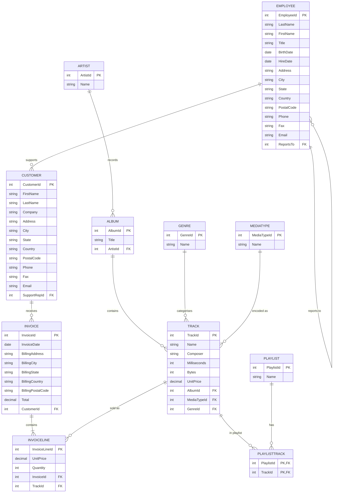

# Chinook — Digital Media Store

> The popular SQLite sample database for a fictional music (and media) store,
> modelled after iTunes. Because it ships as a real SQLite file, Chinook is the
> default play-ground for practicing `JOIN`s, artist/album/track hierarchies,
> and playlist many-to-many relations on the exact engine this app uses.

## ER Diagram (Mermaid)



## ASCII Diagram

```
   EMPLOYEE
   |      ^
   |      | ReportsTo (self FK)
   |      |
   |  +---+
   |  |
   v  +--------+
   CUSTOMER     |
   |            |
   | *          |
   v            |
   INVOICE      |
   | *          |
   v            |
   INVOICELINE  |
   | *          |
   +---> TRACK <--- ALBUM <--- ARTIST
              ^      ^
              |      |
              |      +--- GENRE
              +--- MEDIATYPE
              |
              *--- PLAYLISTTRACK ---> PLAYLIST
```

## Tables

| Table           | PK                     | Key FKs                                                         | Notes                        |
| --------------- | ---------------------- | --------------------------------------------------------------- | ---------------------------- |
| `Artist`        | `ArtistId`             | —                                                               | —                            |
| `Album`         | `AlbumId`              | `ArtistId → Artist`                                             | —                            |
| `Track`         | `TrackId`              | `AlbumId → Album`, `GenreId → Genre`, `MediaTypeId → MediaType` | Leaf content                 |
| `Genre`         | `GenreId`              | —                                                               | Lookup                       |
| `MediaType`     | `MediaTypeId`          | —                                                               | Lookup (MPEG, AAC…)          |
| `Playlist`      | `PlaylistId`           | —                                                               | —                            |
| `PlaylistTrack` | `PlaylistId`+`TrackId` | both composite FKs                                              | M:N playlists ↔ tracks       |
| `Employee`      | `EmployeeId`           | `ReportsTo → Employee`                                          | Self-referencing hierarchy   |
| `Customer`      | `CustomerId`           | `SupportRepId → Employee`                                       | Sales-support assignment     |
| `Invoice`       | `InvoiceId`            | `CustomerId → Customer`                                         | Header, denormalised address |
| `InvoiceLine`   | `InvoiceLineId`        | `InvoiceId → Invoice`, `TrackId → Track`                        | Line items                   |

## Notable Design Patterns

- **Deep dimension chain**: `Artist → Album → Track` is a one-to-many waterfall
  that appears constantly in analytics joins.
- **Denormalised billing address** on `Invoice`: the address is copied onto the
  invoice header rather than FK'd to `Customer`, so history survives address
  changes — a deliberate anti-normalisation choice.
- **`PlaylistTrack` junction with no surrogate**: composite PK, pure M:N.
- **`MediaType`/`Genre` lookups** keep `Track` narrow.
- Two **employee references** (`Customer.SupportRepId`, `Employee.ReportsTo`)
  demonstrate both a functional FK and a recursive FK in one small schema.

## Sample Queries

```sql
-- Longest album by total playing time
SELECT ar.name AS artist, al.title AS album,
       COUNT(*) AS tracks, SUM(t.milliseconds) / 60000 AS minutes
FROM artist ar
JOIN album al ON al.artistId = ar.artistId
JOIN track t  ON t.albumId   = al.albumId
GROUP BY al.albumId
ORDER BY minutes DESC
LIMIT 5;

-- Revenue per genre
SELECT g.name AS genre, SUM(il.unitPrice * il.quantity) AS revenue
FROM genre g
JOIN track t        ON t.genreId    = g.genreId
JOIN invoiceline il ON il.trackId   = t.trackId
JOIN invoice i      ON i.invoiceId  = il.invoiceId
GROUP BY g.genreId
ORDER BY revenue DESC;

-- Customers and their support rep, including the rep's manager
SELECT c.firstName || ' ' || c.lastName AS customer,
       e.firstName AS rep, m.firstName AS repManager
FROM customer c
JOIN employee e ON e.employeeId = c.supportRepId
LEFT JOIN employee m ON m.employeeId = e.reportsTo;
```

## Recreate the Sample

Run these statements in order to rebuild the schema.

```sql
PRAGMA foreign_keys = ON;

CREATE TABLE artist (
  artistId INTEGER PRIMARY KEY,
  name     TEXT NOT NULL
);

CREATE TABLE album (
  albumId  INTEGER PRIMARY KEY,
  title    TEXT NOT NULL,
  artistId INTEGER NOT NULL REFERENCES artist(artistId)
);

CREATE TABLE genre (
  genreId INTEGER PRIMARY KEY,
  name    TEXT NOT NULL
);

CREATE TABLE mediatype (
  mediaTypeId INTEGER PRIMARY KEY,
  name        TEXT NOT NULL
);

CREATE TABLE track (
  trackId      INTEGER PRIMARY KEY,
  name         TEXT NOT NULL,
  composer     TEXT,
  milliseconds INTEGER,
  bytes        INTEGER,
  unitPrice    REAL,
  albumId      INTEGER NOT NULL REFERENCES album(albumId),
  mediaTypeId  INTEGER NOT NULL REFERENCES mediatype(mediaTypeId),
  genreId      INTEGER REFERENCES genre(genreId)
);

CREATE TABLE playlist (
  playlistId INTEGER PRIMARY KEY,
  name       TEXT NOT NULL
);

CREATE TABLE playlisttrack (
  playlistId INTEGER NOT NULL REFERENCES playlist(playlistId),
  trackId    INTEGER NOT NULL REFERENCES track(trackId),
  PRIMARY KEY (playlistId, trackId)
);

CREATE TABLE employee (
  employeeId INTEGER PRIMARY KEY,
  lastName   TEXT NOT NULL,
  firstName  TEXT NOT NULL,
  title      TEXT,
  birthDate  TEXT,
  hireDate   TEXT,
  address    TEXT,
  city       TEXT,
  state      TEXT,
  country    TEXT,
  postalCode TEXT,
  phone      TEXT,
  fax        TEXT,
  email      TEXT,
  reportsTo  INTEGER REFERENCES employee(employeeId)
);

CREATE TABLE customer (
  customerId   INTEGER PRIMARY KEY,
  firstName    TEXT NOT NULL,
  lastName     TEXT NOT NULL,
  company      TEXT,
  address      TEXT,
  city         TEXT,
  state        TEXT,
  country      TEXT,
  postalCode   TEXT,
  phone        TEXT,
  fax          TEXT,
  email        TEXT,
  supportRepId INTEGER REFERENCES employee(employeeId)
);

CREATE TABLE invoice (
  invoiceId         INTEGER PRIMARY KEY,
  invoiceDate       TEXT NOT NULL,
  billingAddress    TEXT,
  billingCity       TEXT,
  billingState      TEXT,
  billingCountry    TEXT,
  billingPostalCode TEXT,
  total             REAL NOT NULL,
  customerId        INTEGER NOT NULL REFERENCES customer(customerId)
);

CREATE TABLE invoiceline (
  invoiceLineId INTEGER PRIMARY KEY,
  unitPrice     REAL NOT NULL,
  quantity      INTEGER NOT NULL,
  invoiceId     INTEGER NOT NULL REFERENCES invoice(invoiceId),
  trackId       INTEGER NOT NULL REFERENCES track(trackId)
);
```
