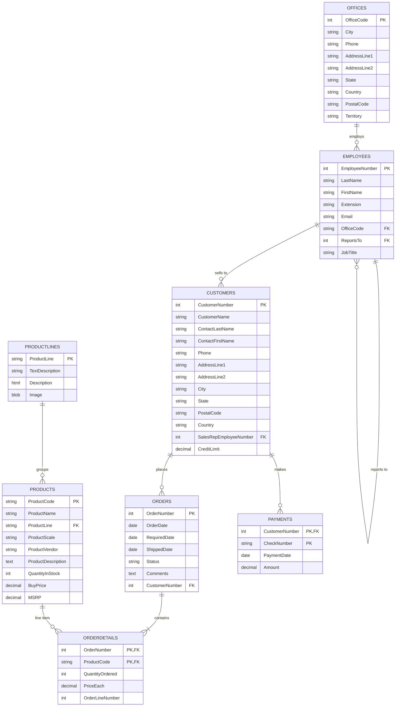

# ClassicModels — B2B Retail Store

> The MySQL sample database for a model-car wholesaler. Its charm is the
> `orderdetails` junction table with a composite PK, the `employees` hierarchy,
> and simple office/customer geography — ideal for teaching realistic reporting
> queries.

## ER Diagram (Mermaid)



## ASCII Diagram

```
+--------------------+         +-----------------------+
|    PRODUCTLINES    |         |       OFFICES         |
|--------------------|         |-----------------------|
| PK ProductLine     |         | PK OfficeCode         |
+--------------------+         +-----------------------+
        | 1                                 | 1
        | *                                | *
        v                                  v
+--------------------+         +-----------------------+
|      PRODUCTS      |         |       EMPLOYEES       |
|--------------------|         |-----------------------|
| PK ProductCode     |         | PK EmployeeNumber     |
| FK ProductLine     |         | FK OfficeCode         |
|    QuantityInStock |         | FK ReportsTo -------- | self FK
|    BuyPrice        |         |    Email              |
|    MSRP            |         |    JobTitle           |
+--------------------+         +-----------------------+
        | 1                                   | 1
        | *                                  | *
        v                                    v
+--------------------+         +-----------------------+
|    ORDERDETAILS    |         |       CUSTOMERS       |
|--------------------|         |-----------------------|
| FK OrderNumber  *- |---------| PK CustomerNumber     |
| FK ProductCode  *- |         | FK SalesRepEmployeeNumber
|    QuantityOrdered |         |    CreditLimit        |
|    PriceEach       |         +-----------------------+
+--------------------+                     | 1
                                           | *
+--------------------+         +--------------------+   +--------------------+
|      ORDERS        |         |      PAYMENTS      |   |                    |
|--------------------|         |--------------------|   |                    |
| PK OrderNumber     |---------| PK CustomerNumber  |   |                    |
| FK CustomerNumber  |  *  1   | PK CheckNumber     |   |                    |
|    Status          |         |    PaymentDate     |   |                    |
|    OrderDate       |         |    Amount          |   |                    |
+--------------------+         +--------------------+   +--------------------+
```

## Tables

| Table          | PK                             | Key FKs                                         | Notes                         |
| -------------- | ------------------------------ | ----------------------------------------------- | ----------------------------- |
| `Offices`      | `OfficeCode` (TEXT)            | —                                               | Natural-key geography         |
| `Employees`    | `EmployeeNumber`               | `OfficeCode → Offices`, `ReportsTo → Employees` | Self-referencing mgr tree     |
| `Customers`    | `CustomerNumber`               | `SalesRepEmployeeNumber → Employees`            | Sales territory ownership     |
| `Orders`       | `OrderNumber`                  | `CustomerNumber → Customers`                    | Header, with status lifecycle |
| `OrderDetails` | `OrderNumber`+`ProductCode`    | both composite FKs                              | Line items                    |
| `Products`     | `ProductCode` (TEXT)           | `ProductLine → ProductLines`                    | Natural code as PK            |
| `ProductLines` | `ProductLine`                  | —                                               | Category lookup               |
| `Payments`     | `CustomerNumber`+`CheckNumber` | `CustomerNumber → Customers`                    | Composite PK, checks as keys  |

## Notable Design Patterns

- **Natural text keys**: `OfficeCode` and `ProductCode` are human-readable
  identifiers used as primary keys — a nice contrast to integer surrogates.
- **Employee sales hierarchy**: `Customers.SalesRepEmployeeNumber` links each
  account to a salesperson inside the `Employees` tree; combined with the
  self-FK you can roll revenue up to a manager.
- **Composite natural PK on `payments`**: `(CustomerNumber, CheckNumber)` —
  real-world business key rather than a synthetic `PaymentID`.
- **`orderdetails` double FK**: `(OrderNumber, ProductCode)` is both the PK and
  two FKs, the textbook "association table".
- **Status-driven pipeline**: `orders.Status` ('In Process', 'Shipped',
  'Resolved', 'Cancelled') is a clean example of state-machine data.

## Sample Queries

```sql
-- Revenue by product line
SELECT pl.productLine, SUM(od.quantityOrdered * od.priceEach) AS revenue
FROM productlines pl
JOIN products p      ON p.productLine = pl.productLine
JOIN orderdetails od ON od.productCode = p.productCode
JOIN orders o        ON o.orderNumber = od.orderNumber
WHERE o.status IN ('Shipped', 'Resolved')
GROUP BY pl.productLine
ORDER BY revenue DESC;

-- Salesperson performance, with their office
SELECT e.firstName, e.lastName, o.city AS office, COUNT(DISTINCT o2.orderNumber) AS orders
FROM employees e
JOIN offices o   ON o.officeCode = e.officeCode
JOIN customers c ON c.salesRepEmployeeNumber = e.employeeNumber
JOIN orders o2   ON o2.customerNumber = c.customerNumber
WHERE o2.status IN ('Shipped', 'Resolved')
GROUP BY e.employeeNumber
ORDER BY orders DESC;

-- Inventory below reorder pressure (ordered but not yet shipped)
SELECT p.productName, p.quantityInStock, SUM(od.quantityOrdered) AS onOrder
FROM products p
JOIN orderdetails od ON od.productCode = p.productCode
JOIN orders o        ON o.orderNumber = od.orderNumber
WHERE o.status IN ('In Process', 'On Hold')
GROUP BY p.productCode
HAVING onOrder > p.quantityInStock;
```

## Recreate the Sample

Run these statements in order to rebuild the schema.

```sql
PRAGMA foreign_keys = ON;

CREATE TABLE offices (
  officeCode   TEXT PRIMARY KEY,
  city         TEXT NOT NULL,
  phone        TEXT NOT NULL,
  addressLine1 TEXT,
  addressLine2 TEXT,
  state        TEXT,
  country      TEXT NOT NULL,
  postalCode   TEXT,
  territory    TEXT NOT NULL
);

CREATE TABLE employees (
  employeeNumber INTEGER PRIMARY KEY,
  lastName       TEXT NOT NULL,
  firstName      TEXT NOT NULL,
  extension      TEXT NOT NULL,
  email          TEXT NOT NULL,
  officeCode     TEXT NOT NULL REFERENCES offices(officeCode),
  reportsTo      INTEGER REFERENCES employees(employeeNumber),
  jobTitle       TEXT NOT NULL
);

CREATE TABLE customers (
  customerNumber         INTEGER PRIMARY KEY,
  customerName           TEXT NOT NULL,
  contactLastName        TEXT NOT NULL,
  contactFirstName       TEXT NOT NULL,
  phone                  TEXT NOT NULL,
  addressLine1           TEXT NOT NULL,
  addressLine2           TEXT,
  city                   TEXT NOT NULL,
  state                  TEXT,
  postalCode             TEXT,
  country                TEXT NOT NULL,
  salesRepEmployeeNumber INTEGER REFERENCES employees(employeeNumber),
  creditLimit            REAL
);

CREATE TABLE productlines (
  productLine     TEXT PRIMARY KEY,
  textDescription TEXT,
  htmlDescription TEXT,
  description     TEXT,
  image           TEXT
);

CREATE TABLE products (
  productCode        TEXT PRIMARY KEY,
  productName        TEXT NOT NULL,
  productLine        TEXT NOT NULL REFERENCES productlines(productLine),
  productScale       TEXT NOT NULL,
  productVendor      TEXT NOT NULL,
  productDescription TEXT,
  quantityInStock    INTEGER NOT NULL,
  buyPrice           REAL NOT NULL,
  msrp               REAL NOT NULL
);

CREATE TABLE orders (
  orderNumber    INTEGER PRIMARY KEY,
  orderDate      TEXT NOT NULL,
  requiredDate   TEXT NOT NULL,
  shippedDate    TEXT,
  status         TEXT NOT NULL,
  comments       TEXT,
  customerNumber INTEGER NOT NULL REFERENCES customers(customerNumber)
);

CREATE TABLE orderdetails (
  orderNumber     INTEGER NOT NULL REFERENCES orders(orderNumber),
  productCode     TEXT NOT NULL REFERENCES products(productCode),
  quantityOrdered INTEGER NOT NULL,
  priceEach       REAL NOT NULL,
  orderLineNumber INTEGER NOT NULL,
  PRIMARY KEY (orderNumber, productCode)
);

CREATE TABLE payments (
  customerNumber INTEGER NOT NULL REFERENCES customers(customerNumber),
  checkNumber    TEXT NOT NULL,
  paymentDate    TEXT NOT NULL,
  amount         REAL NOT NULL,
  PRIMARY KEY (customerNumber, checkNumber)
);
```
