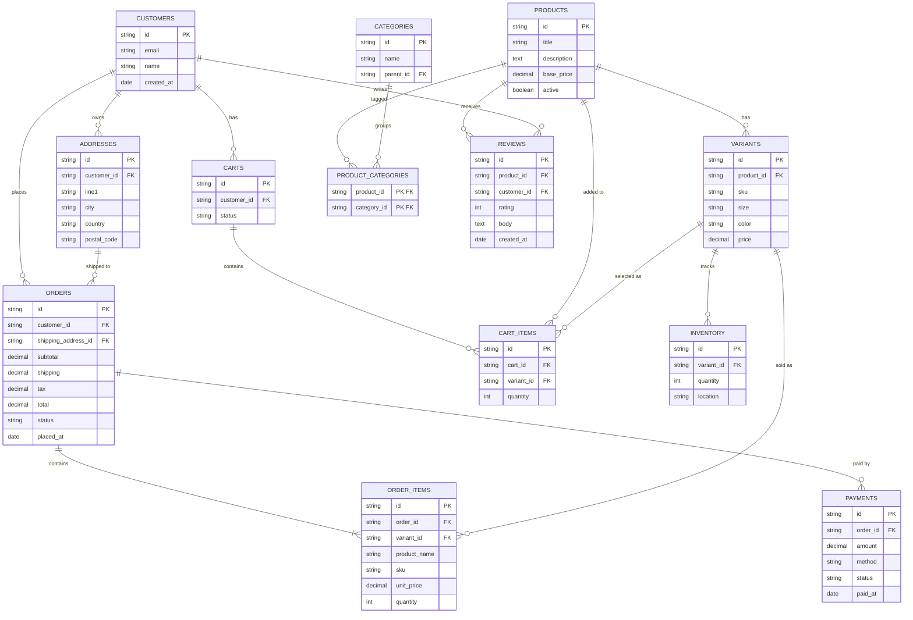

# E-Commerce Platform

> A Shopify/Amazon-style retail platform: products with variants, shopping
> carts, orders, payments, inventory, and customer reviews. This is the schema
> shape most backend engineers are asked to design in interviews.

## ER Diagram (Mermaid)



## ASCII Diagram

```
                    +-----------------+
                    |   CATEGORIES    |--- parent_id (self FK)
                    +-----------------+
                            ^
                            |
            +-------------------------------+
            |       PRODUCT_CATEGORIES      | (junction)
            +-------------------------------+
                            |
                            v
+-----------+      +-----------------+      +-----------+
| CUSTOMERS |<-----|    PRODUCTS     |----->|  REVIEWS  |
+-----------+      +-----------------+      +-----------+
     |                    |
     |                    |
     |             +------------+      +--------+      +-------------+
     |             |  VARIANTS  |      |CARTS   |      | CART_ITEMS  |
     |             +------------+      +--------+      +-------------+
     |                  |                   |                |
     |                  v                   v                |
     |           +------------+        +--------+            |
     |           | INVENTORY  |        |        |            |
     |           +------------+        |        |            |
     |                                 +--------+            |
     v                                                       |
+-----------+      +------------+      +------------+        |
| ADDRESSES |<-----|   ORDERS   |<-----| ORDER_ITEMS|<-------+
+-----------+      +------------+      +------------+
                          |
                          v
                   +------------+
                   |  PAYMENTS  |
                   +------------+
```

## Tables

| Table                | PK    | Key FKs                                          | Notes                       |
| -------------------- | ----- | ------------------------------------------------ | --------------------------- |
| `Customers`          | `id`  | —                                                | —                           |
| `Addresses`          | `id`  | `customer_id → Customers`                        | Many addresses per customer |
| `Products`           | `id`  | —                                                | Base product (title, price) |
| `Variants`           | `id`  | `product_id → Products`                          | SKU/size/colour per item    |
| `Categories`         | `id`  | `parent_id → Categories` (self FK)               | Nested category tree        |
| `Product_Categories` | comp. | both FKs                                         | M:N products ↔ categories   |
| `Carts`              | `id`  | `customer_id → Customers`                        | Active + abandoned carts    |
| `Cart_Items`         | `id`  | `cart_id`, `variant_id`                          | Pending order contents      |
| `Inventory`          | `id`  | `variant_id → Variants`                          | Per-location stock counts   |
| `Orders`             | `id`  | `customer_id`, `shipping_address_id → Addresses` | Snapshot totals + status    |
| `Order_Items`        | `id`  | `order_id`, `variant_id`                         | **Price/sku copied in**     |
| `Payments`           | `id`  | `order_id → Orders`                              | One order may have several  |
| `Reviews`            | `id`  | `product_id`, `customer_id`                      | Rating 1–5 + body           |

## Notable Design Patterns

- **Product → Variant split**: the core e-commerce modelling decision.
  `Products` holds the title/description; `Variants` holds SKU, size, colour,
  and price. Inventory and order lines hang off the variant.
- **Snapshotting at order time**: `Order_Items.product_name`/`sku`/`unit_price`
  are _copied_ into the line, never FK'd back — the seller can later rename or
  re-price a product without rewriting history.
- **Self-FK category tree** (`Categories.parent_id`) supports unlimited nesting.
- **Cart vs Order separation**: `Carts`/`Cart_Items` are mutable; `Orders`/
  `Order_Items` are immutable once placed. Two very different lifetime models.
- **Status strings as data**: `orders.status` and `payments.status` form simple
  state machines queryable with `WHERE`.

## Sample Queries

```sql
-- Highest grossing products (by current variant price, last 90 days)
SELECT p.title, SUM(oi.quantity * oi.unit_price) AS gross
FROM order_items oi
JOIN orders o ON o.id = oi.order_id
JOIN products p ON p.id = oi.product_id
WHERE o.status = 'completed' AND o.placed_at >= datetime('now', '-90 days')
GROUP BY p.id
ORDER BY gross DESC
LIMIT 10;

-- Low stock variants (below 10 units)
SELECT v.sku, v.size, v.color, SUM(i.quantity) AS stock
FROM variants v
JOIN inventory i ON i.variant_id = v.id
GROUP BY v.id
HAVING stock < 10
ORDER BY stock ASC;

-- Average rating per category, only categories with 3+ reviews
SELECT c.name, AVG(r.rating) AS avg_rating, COUNT(r.id) AS reviews
FROM categories c
JOIN product_categories pc ON pc.category_id = c.id
JOIN reviews r ON r.product_id = pc.product_id
GROUP BY c.id
HAVING COUNT(r.id) >= 3
ORDER BY avg_rating DESC;

-- Abandoned carts (created, never converted, older than 7 days)
SELECT c.id, cus.email, SUM(ci.quantity) AS items
FROM carts c
JOIN customers cus ON cus.id = c.customer_id
JOIN cart_items ci  ON ci.cart_id = c.id
WHERE c.status = 'active' AND c.created_at < datetime('now', '-7 days')
GROUP BY c.id;
```

## Recreate the Sample

Run these statements in order to rebuild the schema.

```sql
PRAGMA foreign_keys = ON;

CREATE TABLE customers (
  id         TEXT PRIMARY KEY,
  email      TEXT NOT NULL,
  name       TEXT NOT NULL,
  created_at TEXT
);

CREATE TABLE addresses (
  id          TEXT PRIMARY KEY,
  customer_id TEXT NOT NULL REFERENCES customers(id),
  line1       TEXT NOT NULL,
  city        TEXT NOT NULL,
  country     TEXT NOT NULL,
  postal_code TEXT
);

CREATE TABLE products (
  id          TEXT PRIMARY KEY,
  title       TEXT NOT NULL,
  description TEXT,
  base_price  REAL NOT NULL,
  active      INTEGER NOT NULL DEFAULT 1
);

CREATE TABLE variants (
  id         TEXT PRIMARY KEY,
  product_id TEXT NOT NULL REFERENCES products(id),
  sku        TEXT NOT NULL,
  size       TEXT,
  color      TEXT,
  price      REAL NOT NULL
);

CREATE TABLE categories (
  id        TEXT PRIMARY KEY,
  name      TEXT NOT NULL,
  parent_id TEXT REFERENCES categories(id)
);

CREATE TABLE product_categories (
  product_id  TEXT NOT NULL REFERENCES products(id),
  category_id TEXT NOT NULL REFERENCES categories(id),
  PRIMARY KEY (product_id, category_id)
);

CREATE TABLE carts (
  id          TEXT PRIMARY KEY,
  customer_id TEXT NOT NULL REFERENCES customers(id),
  status      TEXT NOT NULL
);

CREATE TABLE cart_items (
  id         TEXT PRIMARY KEY,
  cart_id    TEXT NOT NULL REFERENCES carts(id),
  variant_id TEXT NOT NULL REFERENCES variants(id),
  quantity   INTEGER NOT NULL DEFAULT 1
);

CREATE TABLE inventory (
  id         TEXT PRIMARY KEY,
  variant_id TEXT NOT NULL REFERENCES variants(id),
  quantity   INTEGER NOT NULL DEFAULT 0,
  location   TEXT
);

CREATE TABLE orders (
  id                  TEXT PRIMARY KEY,
  customer_id         TEXT NOT NULL REFERENCES customers(id),
  shipping_address_id TEXT REFERENCES addresses(id),
  subtotal            REAL NOT NULL,
  shipping            REAL NOT NULL DEFAULT 0,
  tax                 REAL NOT NULL DEFAULT 0,
  total               REAL NOT NULL,
  status              TEXT NOT NULL,
  placed_at           TEXT
);

CREATE TABLE order_items (
  id           TEXT PRIMARY KEY,
  order_id     TEXT NOT NULL REFERENCES orders(id),
  variant_id   TEXT NOT NULL REFERENCES variants(id),
  product_name TEXT NOT NULL,
  sku          TEXT NOT NULL,
  unit_price   REAL NOT NULL,
  quantity     INTEGER NOT NULL
);

CREATE TABLE payments (
  id       TEXT PRIMARY KEY,
  order_id TEXT NOT NULL REFERENCES orders(id),
  amount   REAL NOT NULL,
  method   TEXT,
  status   TEXT NOT NULL,
  paid_at  TEXT
);

CREATE TABLE reviews (
  id          TEXT PRIMARY KEY,
  product_id  TEXT NOT NULL REFERENCES products(id),
  customer_id TEXT NOT NULL REFERENCES customers(id),
  rating      INTEGER NOT NULL CHECK (rating BETWEEN 1 AND 5),
  body        TEXT,
  created_at  TEXT
);
```
