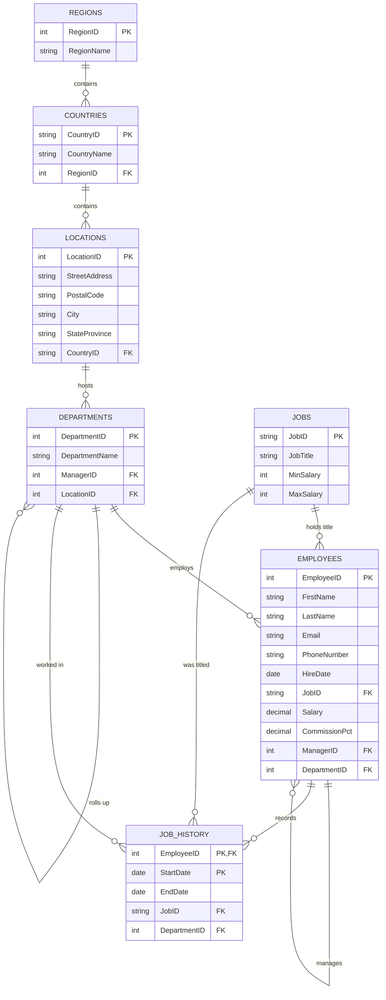

# Oracle HR — Human Resources

> The classic Oracle "HR" sample schema (`employees` sample) that ships with
> every Oracle Database install. Famous for teaching the
> `employees → departments → locations → countries → regions` hierarchy and the
> `job_history` time-series pattern.

## ER Diagram (Mermaid)



## ASCII Diagram

```
 REGIONS ---< COUNTRIES ---< LOCATIONS ---< DEPARTMENTS
                                                   ^   |
                                                   |   | (self FK: roll-up)
                                                   |   v
                                                   | EMPLOYEES
                                                   |   ^   ^
                                                   |   |   | (self FK: manager)
                                                   |   |   |
                                                   +---|   +--- JOBS
                                                       |
                                                JOB_HISTORY (composite PK: EmployeeID + StartDate)
```

## Tables

| Table         | PK                       | Key FKs                                                               | Notes                                       |
| ------------- | ------------------------ | --------------------------------------------------------------------- | ------------------------------------------- |
| `Regions`     | `RegionID`               | —                                                                     | Top of geography                            |
| `Countries`   | `CountryID` (TEXT code)  | `RegionID → Regions`                                                  | 2-letter ISO code PK                        |
| `Locations`   | `LocationID`             | `CountryID → Countries`                                               | Street/city detail                          |
| `Departments` | `DepartmentID`           | `ManagerID → Employees`, `LocationID → Locations`                     | Also self-roll-up? No—roll-up via ManagerID |
| `Employees`   | `EmployeeID`             | `JobID → Jobs`, `ManagerID → Employees`, `DepartmentID → Departments` | Core table                                  |
| `Jobs`        | `JobID` (TEXT code)      | —                                                                     | Title + salary band lookup                  |
| `Job_History` | `EmployeeID`+`StartDate` | `EmployeeID`, `JobID`, `DepartmentID`                                 | Position history over time                  |

## Notable Design Patterns

- **Two self-referencing FKs**: `Employees.ManagerID` (who manages whom) and
  `Departments.ManagerID` (who runs each department). Great for recursive-CTE
  exercises.
- **Natural text keys**: `CountryID` (`'US'`, `'UK'`) and `JobID` (`'IT_PROG'`,
  `'SA_REP'`) as primary keys — compact and readable.
- **`Job_History` composite PK** `(EmployeeID, StartDate)`: a temporal
  "snapshot" of role changes. Combined with `EndDate` it models a time-dimension
  in the classic Kimball sense.
- **Salary band lookup** (`Jobs.MinSalary`/`MaxSalary`) keeps range validation
  data in the database instead of the application.
- Perfect schema for practicing `CONNECT BY` / recursive CTE `WITH RECURSIVE` to
  walk the management tree.

## Sample Queries

```sql
-- Department headcount and salary totals
SELECT d.departmentName, COUNT(e.employeeID) AS headcount,
       ROUND(SUM(e.salary), 2) AS payroll
FROM departments d
JOIN employees e ON e.departmentID = d.departmentID
GROUP BY d.departmentID
ORDER BY payroll DESC;

-- Reporting chain for one employee (recursive CTE)
WITH RECURSIVE chain(id, name, mgr, depth) AS (
  SELECT employeeID, firstName || ' ' || lastName, managerID, 0
  FROM employees WHERE employeeID = 101
  UNION ALL
  SELECT e.employeeID, e.firstName || ' ' || e.lastName, e.managerID, c.depth + 1
  FROM employees e JOIN chain c ON e.employeeID = c.mgr
)
SELECT depth, name FROM chain ORDER BY depth;

-- Everyone who changed department, with tenure per stop
SELECT jh.employeeID, jh.startDate, jh.endDate, j.jobTitle, d.departmentName
FROM job_history jh
JOIN jobs j        ON j.jobID        = jh.jobID
JOIN departments d ON d.departmentID = jh.departmentID
ORDER BY jh.employeeID, jh.startDate;
```

## Recreate the Sample

Run these statements in order to rebuild the schema.

```sql
PRAGMA foreign_keys = ON;

CREATE TABLE regions (
  regionID   INTEGER PRIMARY KEY,
  regionName TEXT NOT NULL
);

CREATE TABLE countries (
  countryID   TEXT PRIMARY KEY,
  countryName TEXT NOT NULL,
  regionID    INTEGER NOT NULL REFERENCES regions(regionID)
);

CREATE TABLE locations (
  locationID    INTEGER PRIMARY KEY,
  streetAddress TEXT,
  postalCode    TEXT,
  city          TEXT NOT NULL,
  stateProvince TEXT,
  countryID     TEXT NOT NULL REFERENCES countries(countryID)
);

CREATE TABLE jobs (
  jobID     TEXT PRIMARY KEY,
  jobTitle  TEXT NOT NULL,
  minSalary REAL,
  maxSalary REAL
);

CREATE TABLE departments (
  departmentID   INTEGER PRIMARY KEY,
  departmentName TEXT NOT NULL,
  managerID      INTEGER REFERENCES employees(employeeID),
  locationID     INTEGER REFERENCES locations(locationID)
);

CREATE TABLE employees (
  employeeID    INTEGER PRIMARY KEY,
  firstName     TEXT NOT NULL,
  lastName      TEXT NOT NULL,
  email         TEXT NOT NULL,
  phoneNumber   TEXT,
  hireDate      TEXT NOT NULL,
  jobID         TEXT NOT NULL REFERENCES jobs(jobID),
  salary        REAL NOT NULL,
  commissionPct REAL,
  managerID     INTEGER REFERENCES employees(employeeID),
  departmentID  INTEGER REFERENCES departments(departmentID)
);

CREATE TABLE job_history (
  employeeID   INTEGER NOT NULL REFERENCES employees(employeeID),
  startDate    TEXT NOT NULL,
  endDate      TEXT NOT NULL,
  jobID        TEXT NOT NULL REFERENCES jobs(jobID),
  departmentID INTEGER NOT NULL REFERENCES departments(departmentID),
  PRIMARY KEY (employeeID, startDate)
);
```
