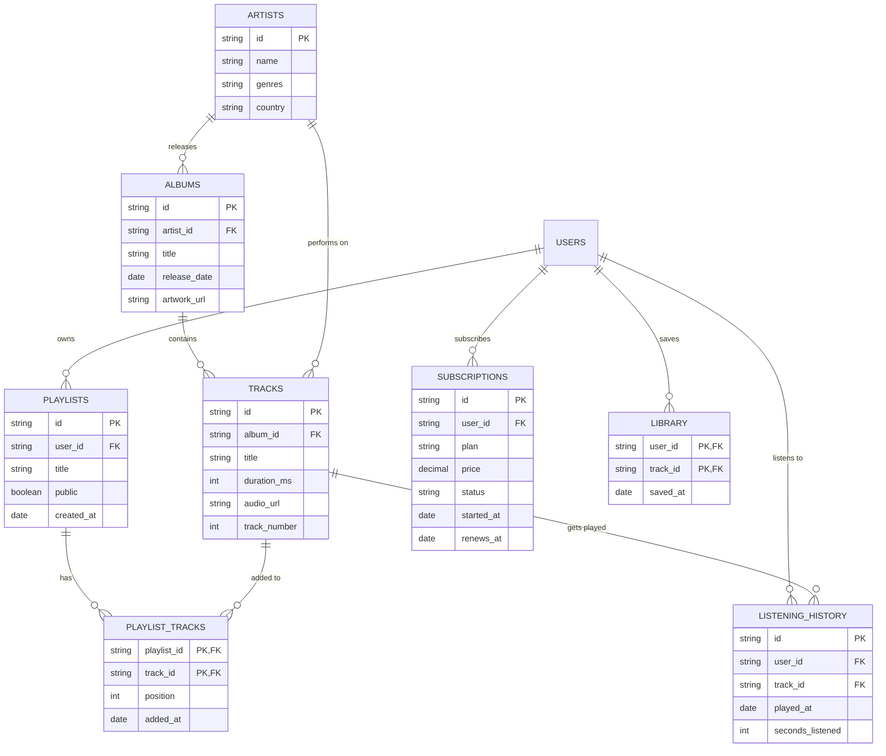

# Music Streaming Service

> A Spotify-style streaming platform: artists, albums, tracks, playlists,
> listening history, subscriptions, and recommendations. A compact schema that
> exercises every join type and both kinds of many-to-many junctions.

## ER Diagram (Mermaid)



## ASCII Diagram

```
   ARTISTS ---< ALBUMS ---< TRACKS ---< LIBRARY (user saved tracks)
      |                         |
      | performs on             | played in
      v                         v
      |                +----------------------+
      +--------------->|  LISTENING_HISTORY   |
      |                |  (user, track, when) |
      |                +----------------------+
      |
      +--< ALBUMS       TRACKS ---< PLAYLIST_TRACKS >--- PLAYLISTS ---< USERS
```

## Tables

| Table               | PK                       | Key FKs               | Notes                             |
| ------------------- | ------------------------ | --------------------- | --------------------------------- |
| `Artists`           | `id`                     | —                     | —                                 |
| `Albums`            | `id`                     | `artist_id → Artists` | One artist per album (simplified) |
| `Tracks`            | `id`                     | `album_id → Albums`   | Leaf audio unit                   |
| `Playlists`         | `id`                     | `user_id → Users`     | Ordered list metadata             |
| `Playlist_Tracks`   | `playlist_id`+`track_id` | both FKs              | **Ordered** junction (position)   |
| `Listening_History` | `id`                     | `user_id`, `track_id` | Event log (fact table)            |
| `Subscriptions`     | `id`                     | `user_id → Users`     | Plan + status + renewal           |
| `Library`           | `user_id`+`track_id`     | both FKs              | Saved tracks (likes)              |

## Notable Design Patterns

- **Three kinds of M:N in one schema**:
  1. `Playlist_Tracks` — junction with a **position** column (order matters).
  2. `Library` — plain saved/liked junction.
  3. `Listening_History` — a **fact table** where each row is an event with its
     own surrogate PK and timestamp.
- **Event logging vs state**: `Listening_History` is append-only and powers
  "wrapped" reports; `Subscriptions.status` is current state. Mixing these two
  modelling styles is realistic.
- **Track-level granularity** (not album) keeps playlists, history, and
  libraries expressive.
- Enables **recommendation queries** via track co-occurrence in
  `Listening_History` or playlists.

## Sample Queries

```sql
-- Most played artists, last 30 days
SELECT ar.name, COUNT(*) AS plays
FROM listening_history lh
JOIN tracks t  ON t.id = lh.track_id
JOIN albums al ON al.id = t.album_id
JOIN artists ar ON ar.id = al.artist_id
WHERE lh.played_at >= datetime('now', '-30 days')
GROUP BY ar.id
ORDER BY plays DESC
LIMIT 10;

-- Top track per artist
SELECT ar.name AS artist, t.title AS track, plays
FROM (
  SELECT al.artist_id, t.id AS track_id, COUNT(*) AS plays,
         ROW_NUMBER() OVER (PARTITION BY al.artist_id ORDER BY COUNT(*) DESC) AS rn
  FROM listening_history lh
  JOIN tracks t  ON t.id = lh.track_id
  JOIN albums al ON al.id = t.album_id
  GROUP BY t.id
) ranked
JOIN tracks t  ON t.id = ranked.track_id
JOIN artists ar ON ar.id = ranked.artist_id
WHERE ranked.rn = 1
ORDER BY plays DESC;

-- Recommended tracks: played by users who share my listening history
SELECT t.title, ar.name AS artist, COUNT(DISTINCT lh2.user_id) AS listeners
FROM listening_history lh1
JOIN listening_history lh2 ON lh2.track_id = lh1.track_id
                            AND lh2.user_id <> lh1.user_id
JOIN tracks t  ON t.id = lh2.track_id
JOIN albums al ON al.id = t.album_id
JOIN artists ar ON ar.id = al.artist_id
WHERE lh1.user_id = 'user-42'
  AND lh2.track_id NOT IN (
    SELECT track_id FROM library WHERE user_id = 'user-42'
  )
  GROUP BY t.id
  ORDER BY listeners DESC
  LIMIT 10;
```

## Recreate the Sample

Run these statements in order to rebuild the schema.

```sql
PRAGMA foreign_keys = ON;

CREATE TABLE users (
  id    TEXT PRIMARY KEY,
  name  TEXT NOT NULL,
  email TEXT NOT NULL
);

CREATE TABLE artists (
  id      TEXT PRIMARY KEY,
  name    TEXT NOT NULL,
  genres  TEXT,
  country TEXT
);

CREATE TABLE albums (
  id           TEXT PRIMARY KEY,
  artist_id    TEXT NOT NULL REFERENCES artists(id),
  title        TEXT NOT NULL,
  release_date TEXT,
  artwork_url  TEXT
);

CREATE TABLE tracks (
  id           TEXT PRIMARY KEY,
  album_id     TEXT NOT NULL REFERENCES albums(id),
  title        TEXT NOT NULL,
  duration_ms  INTEGER,
  audio_url    TEXT,
  track_number INTEGER
);

CREATE TABLE playlists (
  id         TEXT PRIMARY KEY,
  user_id    TEXT NOT NULL REFERENCES users(id),
  title      TEXT NOT NULL,
  public     INTEGER NOT NULL DEFAULT 0,
  created_at TEXT
);

CREATE TABLE playlist_tracks (
  playlist_id TEXT NOT NULL REFERENCES playlists(id),
  track_id    TEXT NOT NULL REFERENCES tracks(id),
  position    INTEGER NOT NULL,
  added_at    TEXT,
  PRIMARY KEY (playlist_id, track_id)
);

CREATE TABLE listening_history (
  id               TEXT PRIMARY KEY,
  user_id          TEXT NOT NULL REFERENCES users(id),
  track_id         TEXT NOT NULL REFERENCES tracks(id),
  played_at        TEXT NOT NULL,
  seconds_listened INTEGER
);

CREATE TABLE subscriptions (
  id         TEXT PRIMARY KEY,
  user_id    TEXT NOT NULL REFERENCES users(id),
  plan       TEXT NOT NULL,
  price      REAL NOT NULL,
  status     TEXT NOT NULL,
  started_at TEXT,
  renews_at  TEXT
);

CREATE TABLE library (
  user_id  TEXT NOT NULL REFERENCES users(id),
  track_id TEXT NOT NULL REFERENCES tracks(id),
  saved_at TEXT,
  PRIMARY KEY (user_id, track_id)
);
```
