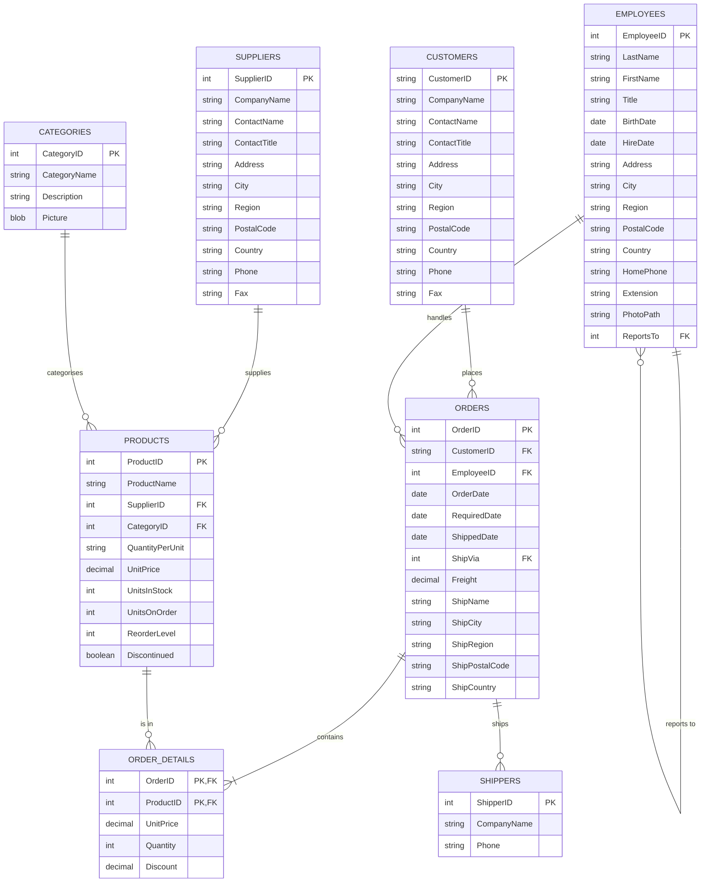

# Northwind Traders

> The classic Microsoft sample database for order management — customers,
> orders, products, suppliers, employees, and shipping. Northwind is the
> best-known "traders" schema ever shipped with SQL Server / Access.

## ER Diagram (Mermaid)



## ASCII Diagram

```
+----------------+         +-------------------+
|   SUPPLIERS    |         |     CATEGORIES    |
|----------------|         |-------------------|
| PK SupplierID  |1       *| PK CategoryID     |
|    CompanyName |---------|    CategoryName   |
|    City        |         |    Description    |
|    Country     |         +-------------------+
+----------------+                     |
       |                              |
       | *                            | *
       v                              v
+----------------+         +-------------------+
|    PRODUCTS    |         |     EMPLOYEES     |
|----------------|         |-------------------|
| PK ProductID   |         | PK EmployeeID     |
| FK SupplierID  |         |    FirstName      |
| FK CategoryID  |         |    LastName       |
|    UnitPrice   |         | FK ReportsTo -----| self FK (manager)
|    UnitsInStock|         +-------------------+
+----------------+                     |
       | *                            | 1
       |                              v
+----------------+         +-------------------+
| ORDER_DETAILS  |         |      ORDERS       |
|----------------|         |-------------------|
| FK OrderID   *-|---------| PK OrderID        |
| FK ProductID *-|  *      | FK CustomerID     |
|    Quantity    |         | FK EmployeeID     |
|    Discount    |         | FK ShipVia        |
+----------------+         |    OrderDate      |
                           |    ShipCountry    |
                           +-------------------+
                                 |   |
                                 |   | *    1
                                 |   +--------->+---------------+
                                 |             |   SHIPPERS    |
                                 v             |---------------|
                           +-------------------+ PK ShipperID  |
                           |      CUSTOMERS    |    CompanyName|
                           |-------------------|    Phone      |
                           | PK CustomerID     |                |
                           |    CompanyName    |                |
                           |    ContactName    |                |
                           |    City           |                |
                           |    Country        |                |
                           +-------------------+----------------+
```

## Tables

| Table           | PK                    | Key FKs                                          | Notes                         |
| --------------- | --------------------- | ------------------------------------------------ | ----------------------------- |
| `Customers`     | `CustomerID`          | —                                                | `CustomerID` is a 5-char code |
| `Employees`     | `EmployeeID`          | `ReportsTo → Employees`                          | Self-referencing hierarchy    |
| `Orders`        | `OrderID`             | `CustomerID`, `EmployeeID`, `ShipVia → Shippers` | Header record                 |
| `Order Details` | `OrderID`+`ProductID` | both composite FKs                               | Junction / line items         |
| `Products`      | `ProductID`           | `SupplierID`, `CategoryID`                       | —                             |
| `Suppliers`     | `SupplierID`          | —                                                | —                             |
| `Categories`    | `CategoryID`          | —                                                | —                             |
| `Shippers`      | `ShipperID`           | —                                                | Carrier lookup table          |

## Notable Design Patterns

- **Composite primary key** on `Order Details` (`OrderID`, `ProductID`) — the
  canonical many-to-many junction table.
- **Self-referencing FK** (`Employees.ReportsTo`) models a one-to-many employee
  → manager tree in a single table.
- **Lookup tables** (`Categories`, `Shippers`) keep denormalised string data
  (names, addresses) out of the fact tables.
- **Surrogate vs natural keys**: `CustomerID` is a natural key (customer code),
  everything else uses integer surrogates.
- Order header/line split (**header + detail**) is the classic relational shape
  for any invoice, quote, or receipt.

## Sample Queries

```sql
-- Total sales per category, top 5
SELECT c.CategoryName,
       ROUND(SUM(od.UnitPrice * od.Quantity * (1 - od.Discount)), 2) AS sales
FROM Categories c
JOIN Products p       ON p.CategoryID = c.CategoryID
JOIN Order_Details od ON od.ProductID  = p.ProductID
GROUP BY c.CategoryName
ORDER BY sales DESC
LIMIT 5;

-- Employees who shipped more than 50 orders in 1997
SELECT e.FirstName, e.LastName, COUNT(*) AS shipped
FROM Employees e
JOIN Orders o ON o.EmployeeID = e.EmployeeID
WHERE strftime('%Y', o.ShippedDate) = '1997'
GROUP BY e.EmployeeID
HAVING COUNT(*) > 50
ORDER BY shipped DESC;
```

## Recreate the Sample

Run these statements in order to rebuild the schema.

```sql
PRAGMA foreign_keys = ON;

CREATE TABLE Categories (
  CategoryID   INTEGER PRIMARY KEY,
  CategoryName TEXT NOT NULL,
  Description  TEXT,
  Picture      BLOB
);

CREATE TABLE Customers (
  CustomerID   TEXT PRIMARY KEY,
  CompanyName  TEXT NOT NULL,
  ContactName  TEXT,
  ContactTitle TEXT,
  Address      TEXT,
  City         TEXT,
  Region       TEXT,
  PostalCode   TEXT,
  Country      TEXT,
  Phone        TEXT,
  Fax          TEXT
);

CREATE TABLE Employees (
  EmployeeID INTEGER PRIMARY KEY,
  LastName   TEXT NOT NULL,
  FirstName  TEXT NOT NULL,
  Title      TEXT,
  BirthDate  TEXT,
  HireDate   TEXT,
  Address    TEXT,
  City       TEXT,
  Region     TEXT,
  PostalCode TEXT,
  Country    TEXT,
  HomePhone  TEXT,
  Extension  TEXT,
  PhotoPath  TEXT,
  ReportsTo  INTEGER REFERENCES Employees(EmployeeID)
);

CREATE TABLE Suppliers (
  SupplierID   INTEGER PRIMARY KEY,
  CompanyName  TEXT NOT NULL,
  ContactName  TEXT,
  ContactTitle TEXT,
  Address      TEXT,
  City         TEXT,
  Region       TEXT,
  PostalCode   TEXT,
  Country      TEXT,
  Phone        TEXT,
  Fax          TEXT
);

CREATE TABLE Shippers (
  ShipperID   INTEGER PRIMARY KEY,
  CompanyName TEXT NOT NULL,
  Phone       TEXT
);

CREATE TABLE Products (
  ProductID       INTEGER PRIMARY KEY,
  ProductName     TEXT NOT NULL,
  SupplierID      INTEGER REFERENCES Suppliers(SupplierID),
  CategoryID      INTEGER REFERENCES Categories(CategoryID),
  QuantityPerUnit TEXT,
  UnitPrice       REAL,
  UnitsInStock    INTEGER,
  UnitsOnOrder    INTEGER,
  ReorderLevel    INTEGER,
  Discontinued    INTEGER NOT NULL DEFAULT 0
);

CREATE TABLE Orders (
  OrderID        INTEGER PRIMARY KEY,
  CustomerID     TEXT REFERENCES Customers(CustomerID),
  EmployeeID     INTEGER REFERENCES Employees(EmployeeID),
  OrderDate      TEXT,
  RequiredDate   TEXT,
  ShippedDate    TEXT,
  ShipVia        INTEGER REFERENCES Shippers(ShipperID),
  Freight        REAL,
  ShipName       TEXT,
  ShipCity       TEXT,
  ShipRegion     TEXT,
  ShipPostalCode TEXT,
  ShipCountry    TEXT
);

CREATE TABLE Order_Details (
  OrderID   INTEGER NOT NULL REFERENCES Orders(OrderID),
  ProductID INTEGER NOT NULL REFERENCES Products(ProductID),
  UnitPrice REAL NOT NULL,
  Quantity  INTEGER NOT NULL,
  Discount  REAL NOT NULL DEFAULT 0,
  PRIMARY KEY (OrderID, ProductID)
);
```
