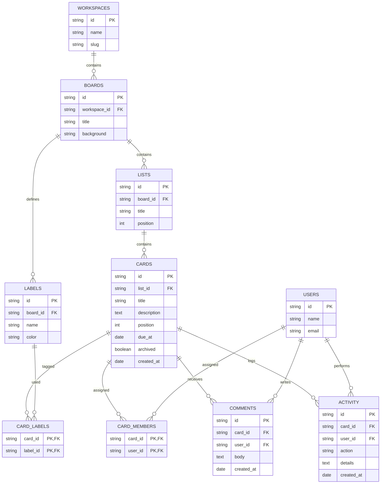

# Project Management (Kanban)

> A Trello/Jira/Asana-style board tool: workspaces, boards, lists, cards,
> labels, assignees, comments, and activity. A great demonstration of ordered
> lists, many-to-many tagging, and audit trails.

## ER Diagram (Mermaid)



## ASCII Diagram

```
  WORKSPACES ---< BOARDS ---< LISTS ---< CARDS ---< COMMENTS
                 |   ^          ^         |
                 |   |          |         +---< ACTIVITY
                 |   |          |
                 |   +----------+         +---------------+
                 |                         | CARD_MEMBERS  |
                 |                         |---------------|
                 |                         | card_id PK,FK |
                 |                         | user_id  PK,FK|
                 |                         +---------------+
                 |                                   |
                 v                                   v
             +--------+   CARD_LABELS          +-----------+
             | LABELS |---<          >---------|   USERS   |
             +--------+   (card_id, label_id)  +-----------+
```

## Tables

| Table          | PK                   | Key FKs                              | Notes                         |
| -------------- | -------------------- | ------------------------------------ | ----------------------------- |
| `Workspaces`   | `id`                 | —                                    | Tenant container              |
| `Boards`       | `id`                 | `workspace_id → Workspaces`          | —                             |
| `Lists`        | `id`                 | `board_id → Boards`                  | `position` orders columns     |
| `Cards`        | `id`                 | `list_id → Lists`                    | `position` orders within list |
| `Labels`       | `id`                 | `board_id → Boards`                  | Board-scoped colours          |
| `Card_Labels`  | `card_id`+`label_id` | both FKs                             | M:N cards ↔ labels            |
| `Users`        | `id`                 | —                                    | Members                       |
| `Card_Members` | `card_id`+`user_id`  | both FKs                             | Assignees (M:N)               |
| `Comments`     | `id`                 | `card_id → Cards`, `user_id → Users` | Card discussion               |
| `Activity`     | `id`                 | `card_id → Cards`, `user_id → Users` | Append-only audit trail       |

## Notable Design Patterns

- **Ordered lists via `position`**: both `Lists` and `Cards` carry an explicit
  `position` integer so drag-and-drop reordering is just an update; the order
  isn't inferred from IDs.
- **Board-scoped labels**: `Labels.board_id` keeps the label palette local to a
  board while the junction table allows re-using one label across many cards.
- **Two M:N relations to `Users`**: `Card_Members` (assignment) is a classic
  junction; `Comments`/`Activity` are fan-out event rows referencing users.
- **Immutable audit log**: `Activity` is append-only (`action`, `details`,
  `created_at`) — never updated in place, so board history is reconstructible.
- **Soft delete via flags** (`cards.archived`, `cards.due_at` nullable) instead
  of physically deleting rows.

## Sample Queries

```sql
-- Board swimlane counts
SELECT l.title AS list, COUNT(c.id) AS cards
FROM lists l
LEFT JOIN cards c ON c.list_id = l.id AND NOT c.archived
WHERE l.board_id = 'board-1'
GROUP BY l.id
ORDER BY l.position;

-- Cards in every list of a board, with label colours
SELECT l.title, c.title AS card,
       GROUP_CONCAT(lb.name, ', ') AS labels
FROM lists l
JOIN cards c        ON c.list_id = l.id AND NOT c.archived
LEFT JOIN card_labels cl ON cl.card_id = c.id
LEFT JOIN labels lb ON lb.id = cl.label_id
WHERE l.board_id = 'board-1'
GROUP BY c.id
ORDER BY l.position, c.position;

-- Cards assigned to a user across all boards
SELECT b.title AS board, l.title AS list, c.title AS card, c.due_at
FROM card_members cm
JOIN cards c ON c.id = cm.card_id AND NOT c.archived
JOIN lists l ON l.id = c.list_id
JOIN boards b ON b.id = l.board_id
WHERE cm.user_id = 'user-7'
ORDER BY c.due_at IS NULL, c.due_at ASC;

-- Overdue cards on a board
SELECT c.title, c.due_at, u.name AS assignee
FROM cards c
LEFT JOIN card_members cm ON cm.card_id = c.id
LEFT JOIN users u         ON u.id = cm.user_id
WHERE c.list_id IN (SELECT id FROM lists WHERE board_id = 'board-1')
  AND c.due_at < date('now')
  AND NOT c.archived
  AND c.list_id NOT IN (SELECT id FROM lists WHERE title = 'Done');
```

## Recreate the Sample

Run these statements in order to rebuild the schema.

```sql
PRAGMA foreign_keys = ON;

CREATE TABLE workspaces (
  id   TEXT PRIMARY KEY,
  name TEXT NOT NULL,
  slug TEXT
);

CREATE TABLE boards (
  id           TEXT PRIMARY KEY,
  workspace_id TEXT NOT NULL REFERENCES workspaces(id),
  title        TEXT NOT NULL,
  background   TEXT
);

CREATE TABLE lists (
  id       TEXT PRIMARY KEY,
  board_id TEXT NOT NULL REFERENCES boards(id),
  title    TEXT NOT NULL,
  position INTEGER NOT NULL
);

CREATE TABLE cards (
  id          TEXT PRIMARY KEY,
  list_id     TEXT NOT NULL REFERENCES lists(id),
  title       TEXT NOT NULL,
  description TEXT,
  position    INTEGER NOT NULL,
  due_at      TEXT,
  archived    INTEGER NOT NULL DEFAULT 0,
  created_at  TEXT
);

CREATE TABLE labels (
  id       TEXT PRIMARY KEY,
  board_id TEXT NOT NULL REFERENCES boards(id),
  name     TEXT NOT NULL,
  color    TEXT
);

CREATE TABLE card_labels (
  card_id  TEXT NOT NULL REFERENCES cards(id),
  label_id TEXT NOT NULL REFERENCES labels(id),
  PRIMARY KEY (card_id, label_id)
);

CREATE TABLE users (
  id    TEXT PRIMARY KEY,
  name  TEXT NOT NULL,
  email TEXT NOT NULL
);

CREATE TABLE card_members (
  card_id TEXT NOT NULL REFERENCES cards(id),
  user_id TEXT NOT NULL REFERENCES users(id),
  PRIMARY KEY (card_id, user_id)
);

CREATE TABLE comments (
  id         TEXT PRIMARY KEY,
  card_id    TEXT NOT NULL REFERENCES cards(id),
  user_id    TEXT NOT NULL REFERENCES users(id),
  body       TEXT NOT NULL,
  created_at TEXT
);

CREATE TABLE activity (
  id         TEXT PRIMARY KEY,
  card_id    TEXT NOT NULL REFERENCES cards(id),
  user_id    TEXT NOT NULL REFERENCES users(id),
  action     TEXT NOT NULL,
  details    TEXT,
  created_at TEXT
);
```
