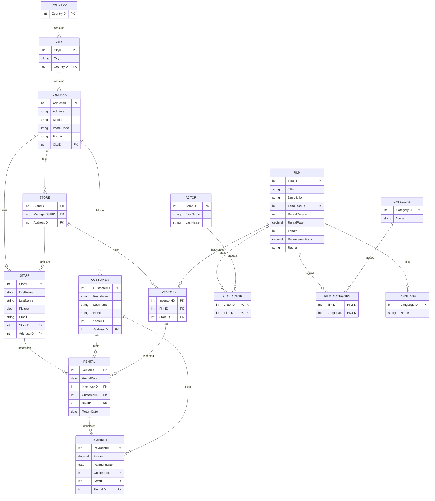

# Sakila — DVD Rental Store

> The modern MySQL sample database for a movie rental shop. Sakila replaces the
> older "world" and "employees" samples and is the go-to schema for teaching
> joins, actors/films many-to-many relations, and payment reporting.

## ER Diagram (Mermaid)



## ASCII Diagram

```
   COUNTRY ---< CITY ---< ADDRESS --< STORE
                |            |          |
                |            |          |---< STAFF
                |            |---< CUSTOMER
                |
  LANGUAGE ---< FILM ---< INVENTORY ---< RENTAL >--- PAYMENT
                  |           ^           ^   ^
                  |--< FILM_ACTOR >--- ACTOR    |--< CUSTOMER
                  |--< FILM_CATEGORY >--- CATEGORY   |--< STAFF
```

## Tables

| Table           | PK                    | Key FKs                                         | Notes                      |
| --------------- | --------------------- | ----------------------------------------------- | -------------------------- |
| `Country`       | `CountryID`           | —                                               | Geographies                |
| `City`          | `CityID`              | `CountryID → Country`                           | —                          |
| `Address`       | `AddressID`           | `CityID → City`                                 | Postal/phone detail        |
| `Store`         | `StoreID`             | `ManagerStaffID → Staff`, `AddressID → Address` | One store per manager      |
| `Staff`         | `StaffID`             | `StoreID → Store`, `AddressID → Address`        | Employees                  |
| `Customer`      | `CustomerID`          | `StoreID → Store`, `AddressID → Address`        | —                          |
| `Film`          | `FilmID`              | `LanguageID → Language`                         | Attributes in `Film`       |
| `Actor`         | `ActorID`             | —                                               | —                          |
| `Film_Actor`    | `ActorID`+`FilmID`    | both composite FKs                              | M:N actors ↔ films         |
| `Category`      | `CategoryID`          | —                                               | Genre lookup               |
| `Film_Category` | `FilmID`+`CategoryID` | both composite FKs                              | M:N films ↔ categories     |
| `Language`      | `LanguageID`          | —                                               | Lookup                     |
| `Inventory`     | `InventoryID`         | `FilmID → Film`, `StoreID → Store`              | Physical copy of a film    |
| `Rental`        | `RentalID`            | `InventoryID`, `CustomerID`, `StaffID`          | Rented copy, returned date |
| `Payment`       | `PaymentID`           | `CustomerID`, `StaffID`, `RentalID → Rental`    | Money received             |

## Notable Design Patterns

- **Inventory as an entity**: `Film` (title, rating, price) is separated from
  `Inventory` (the individual physical copies) — the standard SKU / product /
  instance split.
- **Three many-to-many junctions**: `Film_Actor`, `Film_Category`, and the
  implicit film↔store relationship via `Inventory`. A great study of when to use
  composite-key junction tables.
- **Geography dimension** (`Country → City → Address`) is a clean
  snowflake-style hierarchy reused by stores, staff, and customers.
- **Two "ticket" tables in one flow**: `Rental` captures the loan, `Payment`
  captures the money; both reference `Staff` for auditing who processed them.
- Self-references and lookups keep every fact table narrow and join-heavy —
  realistic for teaching `INNER JOIN`, `GROUP BY`, and reporting.

## Sample Queries

```sql
-- Top 10 rented films of all time
SELECT f.title, COUNT(r.rental_id) AS times_rented
FROM film f
JOIN inventory i ON i.film_id = f.film_id
JOIN rental r    ON r.inventory_id = i.inventory_id
GROUP BY f.film_id
ORDER BY times_rented DESC
LIMIT 10;

-- Revenue per category
SELECT c.name AS category, SUM(p.amount) AS revenue
FROM category c
JOIN film_category fc ON fc.category_id = c.category_id
JOIN film f           ON f.film_id      = fc.film_id
JOIN inventory i      ON i.film_id      = f.film_id
JOIN rental r         ON r.inventory_id = i.inventory_id
JOIN payment p        ON p.rental_id    = r.rental_id
GROUP BY c.category_id
ORDER BY revenue DESC;

-- Films whose actors never overlap with a given actor (complex anti-join)
SELECT f.title
FROM film f
WHERE f.film_id NOT IN (
  SELECT DISTINCT fa.film_id
  FROM film_actor fa
  JOIN film_actor ref ON ref.actor_id = 1
  WHERE fa.actor_id <> 1 AND fa.film_id = ref.film_id
);
```

## Recreate the Sample

Run these statements in order to rebuild the schema.

```sql
PRAGMA foreign_keys = ON;

CREATE TABLE country (
  country_id INTEGER PRIMARY KEY,
  country    TEXT NOT NULL
);

CREATE TABLE city (
  city_id    INTEGER PRIMARY KEY,
  city       TEXT NOT NULL,
  country_id INTEGER NOT NULL REFERENCES country(country_id)
);

CREATE TABLE address (
  address_id  INTEGER PRIMARY KEY,
  address     TEXT NOT NULL,
  district    TEXT,
  postal_code TEXT,
  phone       TEXT,
  city_id     INTEGER NOT NULL REFERENCES city(city_id)
);

CREATE TABLE language (
  language_id INTEGER PRIMARY KEY,
  name        TEXT NOT NULL
);

CREATE TABLE category (
  category_id INTEGER PRIMARY KEY,
  name        TEXT NOT NULL
);

CREATE TABLE actor (
  actor_id   INTEGER PRIMARY KEY,
  first_name TEXT NOT NULL,
  last_name  TEXT NOT NULL
);

CREATE TABLE film (
  film_id          INTEGER PRIMARY KEY,
  title            TEXT NOT NULL,
  description      TEXT,
  language_id      INTEGER NOT NULL REFERENCES language(language_id),
  rental_duration  INTEGER NOT NULL,
  rental_rate      REAL NOT NULL,
  length           INTEGER,
  replacement_cost REAL NOT NULL,
  rating           TEXT
);

CREATE TABLE film_actor (
  actor_id INTEGER NOT NULL REFERENCES actor(actor_id),
  film_id  INTEGER NOT NULL REFERENCES film(film_id),
  PRIMARY KEY (actor_id, film_id)
);

CREATE TABLE film_category (
  film_id     INTEGER NOT NULL REFERENCES film(film_id),
  category_id INTEGER NOT NULL REFERENCES category(category_id),
  PRIMARY KEY (film_id, category_id)
);

CREATE TABLE store (
  store_id         INTEGER PRIMARY KEY,
  manager_staff_id INTEGER REFERENCES staff(staff_id),
  address_id       INTEGER NOT NULL REFERENCES address(address_id)
);

CREATE TABLE staff (
  staff_id   INTEGER PRIMARY KEY,
  first_name TEXT NOT NULL,
  last_name  TEXT NOT NULL,
  picture    BLOB,
  email      TEXT,
  store_id   INTEGER NOT NULL REFERENCES store(store_id),
  address_id INTEGER NOT NULL REFERENCES address(address_id)
);

CREATE TABLE customer (
  customer_id INTEGER PRIMARY KEY,
  first_name  TEXT NOT NULL,
  last_name   TEXT NOT NULL,
  email       TEXT,
  store_id    INTEGER NOT NULL REFERENCES store(store_id),
  address_id  INTEGER NOT NULL REFERENCES address(address_id)
);

CREATE TABLE inventory (
  inventory_id INTEGER PRIMARY KEY,
  film_id      INTEGER NOT NULL REFERENCES film(film_id),
  store_id     INTEGER NOT NULL REFERENCES store(store_id)
);

CREATE TABLE rental (
  rental_id    INTEGER PRIMARY KEY,
  rental_date  TEXT NOT NULL,
  inventory_id INTEGER NOT NULL REFERENCES inventory(inventory_id),
  customer_id  INTEGER NOT NULL REFERENCES customer(customer_id),
  staff_id     INTEGER NOT NULL REFERENCES staff(staff_id),
  return_date  TEXT
);

CREATE TABLE payment (
  payment_id   INTEGER PRIMARY KEY,
  amount       REAL NOT NULL,
  payment_date TEXT NOT NULL,
  customer_id  INTEGER NOT NULL REFERENCES customer(customer_id),
  staff_id     INTEGER NOT NULL REFERENCES staff(staff_id),
  rental_id    INTEGER NOT NULL REFERENCES rental(rental_id)
);
```
