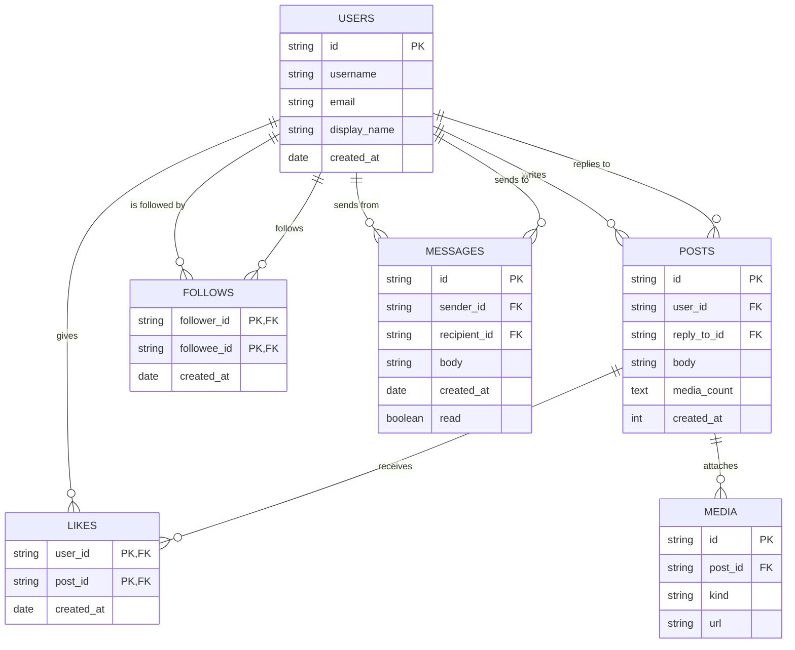

# Social Media Platform

> A Twitter/X-style microblogging service: users, posts (tweets), replies,
> likes, follows, mentions, and direct messages. The classic "fan-out" and
> adjacency-list graph modelling case study.

## ER Diagram (Mermaid)



## ASCII Diagram

```
            +------------------+
            |      USERS       |
            +------------------+
              |  |  |  |  |  |
      writes  |  |  |  |  |  |  follows / followed
              |  |  |  |  |  |
              v  |  |  |  |  |
      +------------------+   |   +------------------+
      |      POSTS       |   |   |     FOLLOWS      |
      |------------------|   |   |------------------|
      | reply_to_id ---->|---+   | follower_id   PK |
      | user_id     ---->|--+    | followee_id   PK |
      +------------------+  |    +------------------+
              |             |
              v             v
      +------------------+  +------------------+
      |      LIKES       |  |     MESSAGES     |
      |------------------|  |------------------|
      | user_id PK, FK   |  | sender_id    FK  |
      | post_id PK, FK   |  | recipient_id FK  |
      +------------------+  +------------------+
              |
              v
      +------------------+
      |      MEDIA       |
      |------------------|
      | post_id FK       |
      +------------------+
```

## Tables

| Table      | PK                          | Key FKs                                  | Notes                     |
| ---------- | --------------------------- | ---------------------------------------- | ------------------------- |
| `Users`    | `id`                        | —                                        | Profile data              |
| `Posts`    | `id`                        | `user_id → Users`, `reply_to_id → Posts` | Self-FK for reply threads |
| `Follows`  | `follower_id`+`followee_id` | both FKs                                 | Directed graph adjacency  |
| `Likes`    | `user_id`+`post_id`         | both FKs                                 | M:N with composite PK     |
| `Media`    | `id`                        | `post_id → Posts`                        | Images/videos attached    |
| `Messages` | `id`                        | `sender_id`, `recipient_id → Users`      | Direct messages           |

## Notable Design Patterns

- **Adjacency-list graph**: `Follows` and `Likes` are edge tables. Following is
  _directed_ — `follower_id → followee_id` — so a composite PK is also the
  natural key that prevents duplicate follows.
- **Reply threading via self-FK**: `Posts.reply_to_id → Posts.id` models a tree;
  combine with recursive CTEs to rebuild full conversation threads.
- **Timeline strategies**: a simple `WHERE author_id IN (SELECT ...)` over
  `Follows` is a pull model; production systems add a materialised `timeline`
  table and fan out on insert (a great design discussion point).
- **M:N likes as pure junction** with `created_at` as an edge attribute.
- **Messages as a normalised table** with read/unread flag instead of a
  denormalised "inbox/outbox" duplication.

## Sample Queries

```sql
-- Home timeline: posts from people I follow, newest first
SELECT p.body, u.username, p.created_at
FROM posts p
JOIN follows f ON f.followee_id = p.user_id
JOIN users  u  ON u.id = p.user_id
WHERE f.follower_id = 'user-1'
  AND p.reply_to_id IS NULL
ORDER BY p.created_at DESC
LIMIT 50;

-- Follow suggestions: who do the people I follow also follow?
SELECT DISTINCT u.username
FROM follows f1
JOIN follows f2 ON f2.follower_id = f1.followee_id
JOIN users u    ON u.id = f2.followee_id
WHERE f1.follower_id = 'user-1'
  AND f2.followee_id <> 'user-1'
  AND f2.followee_id NOT IN (
    SELECT followee_id FROM follows WHERE follower_id = 'user-1'
  )
LIMIT 20;

-- Full reply thread using a recursive CTE
WITH RECURSIVE thread(id, depth) AS (
  SELECT id, 0 FROM posts WHERE id = 'post-100'
  UNION ALL
  SELECT p.id, t.depth + 1
  FROM posts p JOIN thread t ON p.reply_to_id = t.id
)
SELECT p.id, p.body
FROM thread t
JOIN posts p ON p.id = t.id
ORDER BY t.depth;

-- Most liked accounts
SELECT u.username, COUNT(l.user_id) AS likes_received
FROM posts p
JOIN likes l ON l.post_id = p.id
JOIN users u ON u.id = p.user_id
GROUP BY u.id
ORDER BY likes_received DESC
LIMIT 10;
```

## Recreate the Sample

Run these statements in order to rebuild the schema.

```sql
PRAGMA foreign_keys = ON;

CREATE TABLE users (
  id           TEXT PRIMARY KEY,
  username     TEXT NOT NULL,
  email        TEXT NOT NULL,
  display_name TEXT,
  created_at   TEXT
);

CREATE TABLE posts (
  id          TEXT PRIMARY KEY,
  user_id     TEXT NOT NULL REFERENCES users(id),
  reply_to_id TEXT REFERENCES posts(id),
  body        TEXT NOT NULL,
  media_count INTEGER NOT NULL DEFAULT 0,
  created_at  TEXT NOT NULL
);

CREATE TABLE follows (
  follower_id TEXT NOT NULL REFERENCES users(id),
  followee_id TEXT NOT NULL REFERENCES users(id),
  created_at  TEXT,
  PRIMARY KEY (follower_id, followee_id)
);

CREATE TABLE likes (
  user_id    TEXT NOT NULL REFERENCES users(id),
  post_id    TEXT NOT NULL REFERENCES posts(id),
  created_at TEXT,
  PRIMARY KEY (user_id, post_id)
);

CREATE TABLE media (
  id      TEXT PRIMARY KEY,
  post_id TEXT NOT NULL REFERENCES posts(id),
  kind    TEXT,
  url     TEXT NOT NULL
);

CREATE TABLE messages (
  id           TEXT PRIMARY KEY,
  sender_id    TEXT NOT NULL REFERENCES users(id),
  recipient_id TEXT NOT NULL REFERENCES users(id),
  body         TEXT NOT NULL,
  created_at   TEXT,
  read         INTEGER NOT NULL DEFAULT 0
);
```
