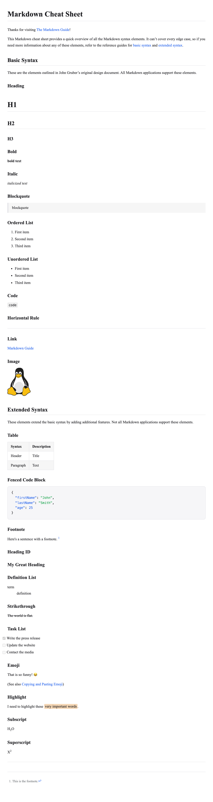
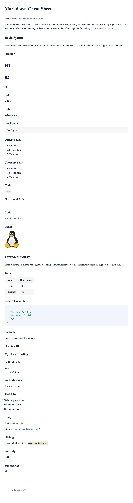
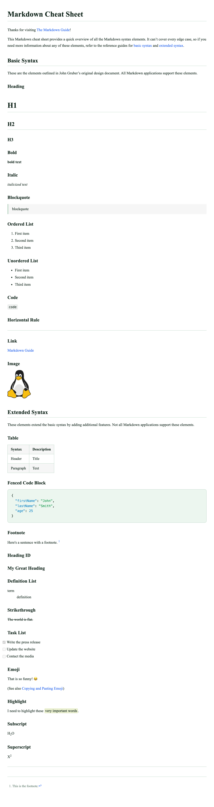
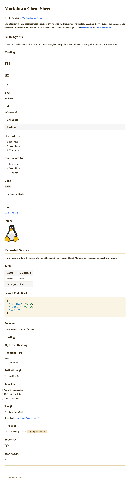
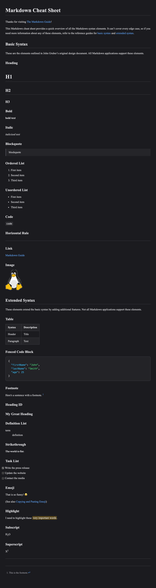
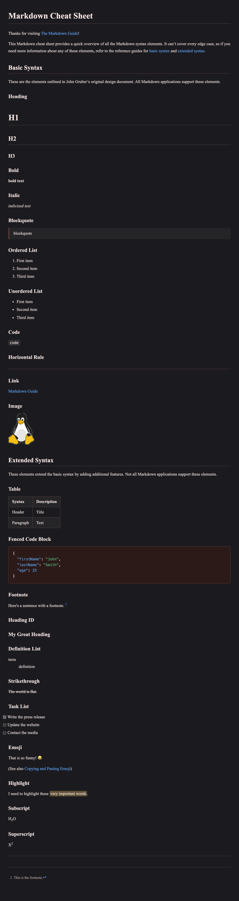
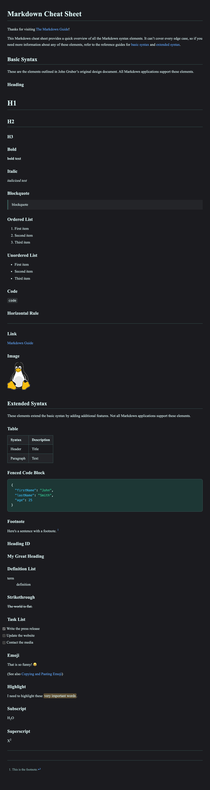
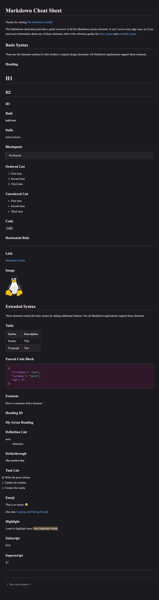

# Example Screenshots

Full-page PNG captures of `public/html/cheat-sheet.<theme>.html` rendered in headless Chromium (2× device-pixel-ratio). Each image shows the [md.css](../../README.md) stylesheet applied to the same cheat-sheet content under a different theme palette.

Regenerate all images: `pnpm run examples` (requires Playwright + Chromium).

## Light themes

| Theme    | Preview                                               | Scheme  |
| -------- | ----------------------------------------------------- | ------- |
| light    |        | `light` |
| cerulean |  | `light` |
| emerald  |    | `light` |
| saffron  |    | `light` |

## Dark themes

| Theme   | Preview                                             | Scheme |
| ------- | --------------------------------------------------- | ------ |
| dark    |        | `dark` |
| crimson |  | `dark` |
| lagoon  |    | `dark` |
| fuchsia |  | `dark` |
