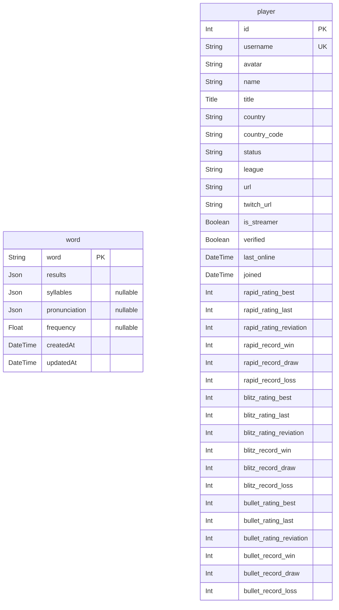

# Prisma Markdown

> Generated by [`prisma-markdown`](https://github.com/samchon/prisma-markdown)

- [default](#default)

## default

### `word`

**Properties**

- `word`:
- `results`:
- `syllables`:
- `pronunciation`:
- `frequency`:
- `createdAt`:
- `updatedAt`:

### `player`

**Properties**

- `id`:
- `username`:
- `avatar`:
- `name`:
- `title`:
- `country`:
- `country_code`:
- `status`:
- `league`:
- `url`:
- `twitch_url`:
- `is_streamer`:
- `verified`:
- `last_online`:
- `joined`:
- `rapid_rating_best`:
- `rapid_rating_last`:
- `rapid_rating_reviation`:
- `rapid_record_win`:
- `rapid_record_draw`:
- `rapid_record_loss`:
- `blitz_rating_best`:
- `blitz_rating_last`:
- `blitz_rating_reviation`:
- `blitz_record_win`:
- `blitz_record_draw`:
- `blitz_record_loss`:
- `bullet_rating_best`:
- `bullet_rating_last`:
- `bullet_rating_reviation`:
- `bullet_record_win`:
- `bullet_record_draw`:
- `bullet_record_loss`:
