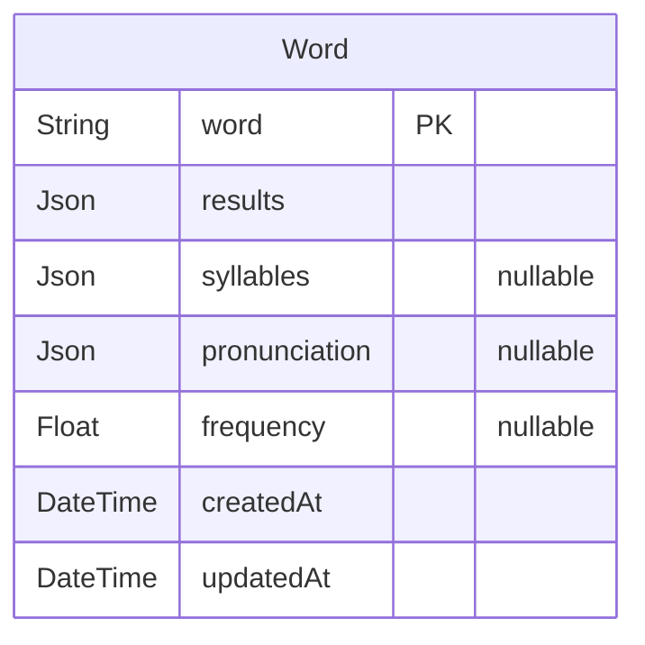

# Prisma Markdown

> Generated by [`prisma-markdown`](https://github.com/samchon/prisma-markdown)

- [default](#default)

## default

### `Word`

**Properties**

- `word`:
- `results`:
- `syllables`:
- `pronunciation`:
- `frequency`:
- `createdAt`:
- `updatedAt`:
